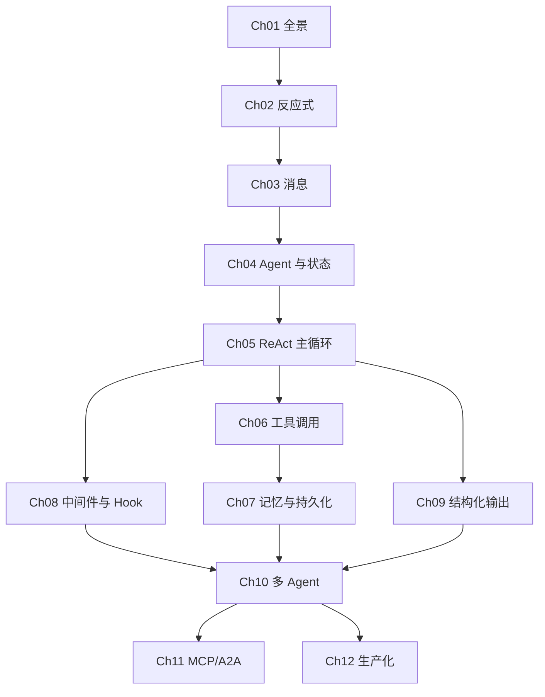

# 课程总目录

> AgentScope Java 深度学习路线 · 12 章 · 基于 v2 主线源码
> 最近更新：2026-06-29 · 维护人：杨海波 & Gennady

## 进度看板

| 状态 | 章节 | 主题 | 预计时长 | 关键源码锚点 |
|---|---|---|---|---|
| ✅ | [Ch01](./chapters/ch01-framework-overview.md) | 框架全景与学习地图 | 1.5h | `ReActAgent.java:190`（入口）/ `:200`（类声明） |
| ✅ | [Ch02](./chapters/ch02-reactive-foundation.md) | 反应式编程基石 | 2.5h | `ReActAgent.java` 全文 Reactor 链 |
| ✅ | [Ch03](./chapters/ch03-message-and-block.md) | 消息模型 `Msg` 与 `ContentBlock` | 2h | `message/Msg.java:842`（9 种 ContentBlock） |
| ✅ | [Ch04](./chapters/ch04-agent-and-state.md) | Agent 抽象与 `AgentState` | 2h | `agent/Agent.java:47`, `agent/AgentBase.java:1035` |
| ✅ | [Ch05](./chapters/ch05-react-loop-deep-dive.md) | ReAct 主循环源码精读 | 3h | `ReActAgent.java:1835 reasoning` / `:2167 acting` / `:2838 summarizing` |
| ✅ | [Ch06](./chapters/ch06-toolkit-and-function-calling.md) | 工具调用与反射 | 3h | `tool/Toolkit.java:1031`, `tool/ReflectiveFunctionTool.java` |
| ✅ | [Ch07](./chapters/ch07-memory-and-persistence.md) | 记忆与持久化 | 2.5h | `state/AgentState.java`, `memory/` |
| ✅ | [Ch08](./chapters/ch08-middleware-and-hooks.md) | 中间件与 Hook 系统 | 2.5h | `middleware/MiddlewareChain.java`, `hook/Hook.java` |
| ✅ | [Ch09](./chapters/ch09-structured-output-and-formatter.md) | 结构化输出与 Formatter | 2h | `formatter/`, `model/StructuredOutputReminder.java` |
| ✅ | [Ch10](./chapters/ch10-multi-agent-and-harness.md) | 多 Agent 与 `HarnessAgent` | 3h | `agentscope-harness/agent/HarnessAgent.java:2251 行` |
| ✅ | [Ch11](./chapters/ch11-mcp-a2a-protocols.md) | MCP / A2A 协议（进阶） | 2.5h | `tool/mcp/`, `extensions-nacos/` |
| ✅ | [Ch12](./chapters/ch12-production-observability.md) | 生产化与可观测性（进阶） | 2.5h | `tracing/`, `shutdown/`, `permission/` |

> **2026-06-29 核验完成**：通过 3 个 Explore agent 核对了 67 个声明点，修复 13 处 A 类严重错误 + 13 处 B 类行号/方法名错。详细核验报告见 `~/.claude/plans/vivid-launching-liskov.md`。

> 状态标记：🔲 未开始 / 🟡 进行中 / ✅ 已完成（当前为**初始化版本**，每章学习时把对应状态改为 🟡 或 ✅）

### 你的学习进度

> 在此追踪你自己的进度。复制定义的章节行，把状态改为 🟡 或 ✅：

<!-- 例：
- [🟡] Ch01 已读，未做实验
- [✅] Ch02 已读，已完成实验
-->
- [🔲] Ch01
- [🔲] Ch02
- [🔲] Ch03
- [🔲] Ch04
- [🔲] Ch05
- [🔲] Ch06
- [🔲] Ch07
- [🔲] Ch08
- [🔲] Ch09
- [🔲] Ch10
- [🔲] Ch11
- [🔲] Ch12

## 章节依赖图

## 实验清单

| 章节 | 实验 | 关键产物 |
|---|---|---|
| Ch01 | [lab/ch01-environment-setup.md](./lab/ch01-environment-setup.md) | 本地构建 + 运行 VersionTest |
| Ch02 | [lab/ch02-mono-flux-warmup.md](./lab/ch02-mono-flux-warmup.md) | 手写 5 个 Mono/Flux 流水线 |
| Ch03 | [lab/ch03-build-msg.md](./lab/ch03-build-msg.md) | 构造多模态 / 多轮 Msg |
| Ch04 | [lab/ch04-first-agent.md](./lab/ch04-first-agent.md) | 最简 Agent + ScriptedModel |
| Ch05 | [lab/ch05-react-with-scripted-model.md](./lab/ch05-react-with-scripted-model.md) | 跑通两轮完整 ReAct |
| Ch06 | [lab/ch06-tool-registration.md](./lab/ch06-tool-registration.md) | 注册天气查询 + 计算器工具 |
| Ch07 | [lab/ch07-persistence-and-long-term-memory.md](./lab/ch07-persistence-and-long-term-memory.md) | JSON 持久化 + 多轮恢复 |
| Ch08 | [lab/ch08-custom-hook-middleware.md](./lab/ch08-custom-hook-middleware.md) | Token 统计 Middleware + 脱敏 Hook |
| Ch09 | [lab/ch09-structured-output.md](./lab/ch09-structured-output.md) | POJO 强制输出 |
| Ch10 | [lab/ch10-multi-agent-orchestration.md](./lab/ch10-multi-agent-orchestration.md) | 研究员 + 写作者 协作 |
| Ch11 | [lab/ch11-mcp-filesystem.md](./lab/ch11-mcp-filesystem.md) | MCP filesystem server 接入 |
| Ch12 | [lab/ch12-tracing-and-shutdown.md](./lab/ch12-tracing-and-shutdown.md) | JSONL trace 导出 + 优雅停机 |

## 跳转

- 上一节：[README.md](./README.md)
- 下一节：[01-roadmap.md](./01-roadmap.md)
