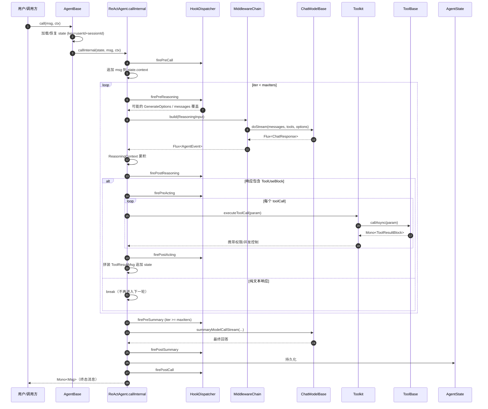
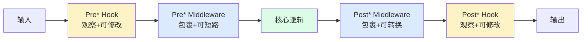
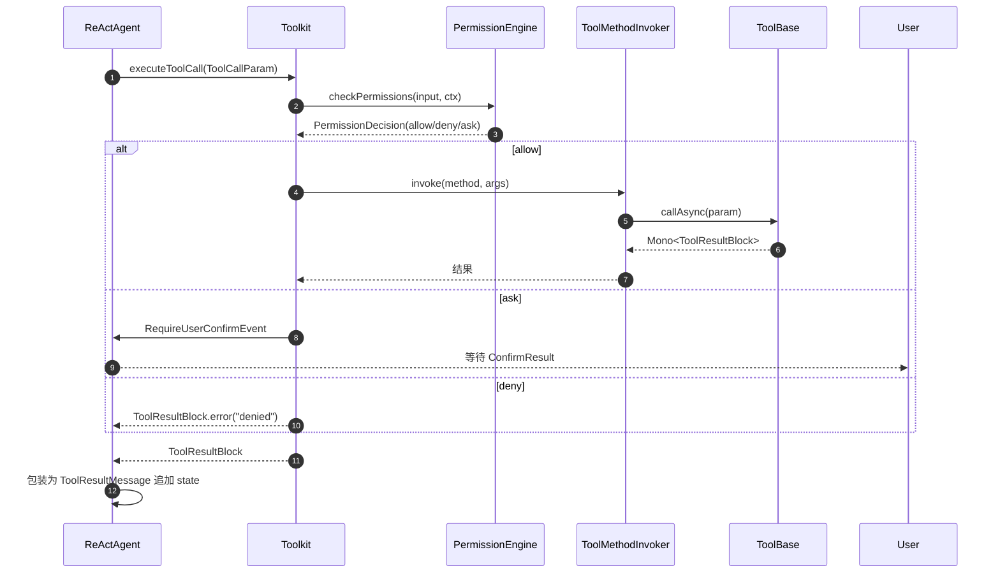

# ReAct 主循环时序图

> 引用自 `agentscope-core/src/main/java/io/agentscope/core/ReActAgent.java:795 buildAgentStream`（**注意：不是 L769 callInternal** —— `callInternal` 只有 5 行壳，本图描述的是它驱动的真实 7 步事件流）

## 整体一次 `agent.call(msg, ctx)` 的事件流

## 中间件与 Hook 的差异

- **Hook**：事件订阅者，**可观察 + 可修改**事件载荷，不控制流（不能短路）
- **Middleware**：AOP 拦截器，**可包裹**核心逻辑，**可短路 / 转换**输入输出

## 工具调用一次往返

