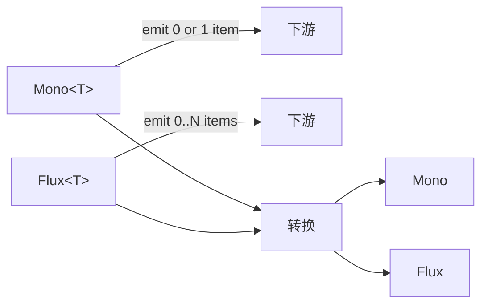

# Ch02 · 反应式编程基石（Project Reactor）

> 状态：🔲 · 预计时长：2.5h · 前置：Ch01

## 1. 本章目标

- 掌握 `Mono<T>` / `Flux<T>` 的 5 个最常用操作符
- 理解 Reactor 的**背压**机制在 Agent 场景的意义
- 能在 `ReActAgent.java` 中识别出每个 Mono/Flux 的**生命周期**
- 理解为什么框架**禁止** `Thread.sleep` / `ThreadLocal`

## 2. 核心概念

### 2.1 为什么是 Reactor？

`agentscope-java` 的工作流本质是：

```
用户输入 ──▶ 推理（HTTP 请求 LLM）──▶ 工具调用（本地/远程/HTTP）
                  ▲                              │
                  └──── 拼装成下一轮推理 ◀────────┘
```

每一环都是**异步 + 可阻塞 + 可超时**。如果用 `CompletableFuture` 拼接，你很快会遇到：

1. 串行编排多个异步任务时，`thenCompose` 的异常吞噬问题
2. 需要把中间结果透传给下游时，`whenComplete` 的可读性差
3. 多个工具**并发**调用又要**限流**时，需要手写 `Semaphore`
4. 流式输出（LLM 的 SSE）时，没有等价于 `Flux` 的组合子

Reactor 给的承诺：

| 需求 | Reactor 解法 |
|---|---|
| 单值异步结果 | `Mono<T>` |
| 多值 / 流 | `Flux<T>` |
| 串行 + 异常传递 | `flatMap` / `Mono.zip` |
| 并行 + 限流 | `flatMap(..., n)` / `parallel()` |
| 背压 | `onBackpressureBuffer` / `onBackpressureDrop` |
| 流式 SSE 拼装 | `Flux.create` + `flatMapMany` |
| 上下文传递 | `Mono.deferContextual` / `Reactor Context` |

### 2.2 Mono vs Flux 一图流



Agent 框架里：

- `Mono<Msg>` —— 一次 `agent.call(...)` 的终态消息
- `Flux<ChatResponse>` —— LLM 的流式返回（SSE）
- `Flux<AgentEvent>` —— Agent 内部事件的发布流
- `Mono<ToolResultBlock>` —— 一次工具调用的结果

### 2.3 五个必会操作符

#### 2.3.1 `map` vs `flatMap` vs `flatMapMany`

```java
// map: 1对1同步转换
Mono<Msg> m1 = mono.map(msg -> msg.withText("[processed] " + msg.getTextContent()));

// flatMap: 1对1异步转换（返回 Mono）
Mono<Msg> m2 = mono.flatMap(msg -> callLlmAsync(msg));  // callLlmAsync 返回 Mono<Msg>

// flatMapMany: 1对多（把 Mono 摊成 Flux）
Flux<Token> tokens = mono.flatMapMany(msg -> tokenizeStream(msg));
```

#### 2.3.2 `then` —— 串联副作用

```java
// 执行 A，然后执行 B（不关心 A 的结果）
Mono<Msg> pipeline = persistState()
    .then(doSomethingElse())
    .then(callLlm());
```

#### 2.3.3 `Mono.zip` —— 等待多个并发源

```java
// 三个工具并发调用，全部就绪后再继续
Mono<Tuple3<Res, Res, Res>> all = Mono.zip(
    weatherTool.call(param1),
    calendarTool.call(param2),
    emailTool.call(param3)
);
```

#### 2.3.4 `onErrorResume` vs `onErrorReturn`

```java
// 兜底：失败时返回默认值
Mono<Msg> m = callLlm()
    .onErrorReturn(Msg.builder().textContent("[服务暂不可用]").build());

// 兜底：失败时切换到备用源
Mono<Msg> m = primaryLlm.call(msg)
    .onErrorResume(e -> fallbackLlm.call(msg));
```

#### 2.3.5 `subscribeOn` / `publishOn` —— 切换执行线程

```java
// 慢操作放到 boundedElastic 池
Mono<HttpResponse> r = httpClient.send(req)
    .subscribeOn(Schedulers.boundedElastic());
```

### 2.4 背压（Backpressure）

**场景**：LLM 一次返回 1000 token，UI 渲染跟不上。

```java
Flux<ChatResponse> stream = model.doStream(messages, tools, options);

// 限速：每秒最多 10 个元素
stream
    .onBackpressureBuffer(100)  // 缓冲最多 100 个
    .delayElements(Duration.ofMillis(100))
    .subscribe(chunk -> ui.append(chunk));
```

### 2.5 上下文（Context）

替代 `ThreadLocal` 的方式。框架内 `RuntimeContext` 透传就用这个。

```java
Mono<Msg> m = Mono.deferContextual(ctx -> {
    String sessionId = ctx.get("sessionId");
    return loadState(sessionId).flatMap(state -> callLlm(state));
}).contextWrite(Context.of("sessionId", "demo"));
```

**为什么不用 `ThreadLocal`**：

- Reactor 操作在不同线程池切换，`ThreadLocal` 会丢值
- `Context` 是**不可变 + 沿操作链传递**，天然支持反应式

## 3. 源码精读

### 3.1 `ReActAgent.java` 中的反应式骨架

读 `ReActAgent.java:769 callInternal`（约 80 行），注意以下结构：

```java
protected Mono<Msg> callInternal(AgentState state, Msg msg, RuntimeContext rc) {
    // 1. 准备阶段：fire PreHook（同步）
    return hookDispatcher.firePreCall(state, rc, msg)
        // 2. 加载/合并系统消息
        .then(Mono.defer(() -> {
            // 3. 拼装迭代入口
            return reasoning(0, false);   // 4. 这里是 Mono<Msg>
        }))
        // 5. 错误兜底
        .onErrorResume(...)
        // 6. 清理
        .doFinally(...)
        // 7. 包装成单值
        .single();
}
```

**观察 1**：`firePreCall` 走的是 Hook 系统（事件订阅），而 `reasoning` 走的是 Middleware 链（包裹），两者在反应式管线中**位置不同**。

**观察 2**：用 `Mono.defer` 包一层是为了**延迟执行**——只有订阅时才计算 messages 列表。

**观察 3**：`.single()` 确保返回 `Mono<Msg>` 而不是 `Flux<Msg>`，与 `Agent` 接口契约一致（`Agent.java:47` 接口定义）。

### 3.2 `reasoning()` 里的多阶段组合

读 `ReActAgent.java:1835-1930`：

```java
private Mono<Msg> reasoning(int iter, boolean ignoreMaxIters) {
    if (!ignoreMaxIters && iter >= maxIters) {
        return summarizing();
    }

    return checkInterrupted()
        .then(hookDispatcher.firePreReasoning(...))    // 1. Pre Hook
        .flatMap(event -> {
            // 2. 构造模型输入
            List<Msg> modelInput = prependSystemMsg(...);
            List<ToolSchema> tools = toolkit.getToolSchemas(...);
            GenerateOptions options = ...;

            // 3. 套 Middleware 链
            Flux<AgentEvent> stream = MiddlewareChain.build(
                middlewares, ..., MiddlewareBase::onReasoning, reasoningCore
            ).apply(new ReasoningInput(modelInput, tools, options));

            // 4. 累积 + 折叠
            return stream.doOnNext(ev -> { /* 累积到 context */ })
                         .then(Mono.defer(() -> Mono.justOrEmpty(context.buildFinalMessage())));
        })
        .onErrorResume(InterruptedException.class, ...);
}
```

**观察 4**：`flatMap` 内部把 `Flux<AgentEvent>` 用 `.then(...)` 折叠回 `Mono<Msg>`。这正是 `Flux<AgentEvent> → Mono<Msg>` 的标准折叠模式。

**观察 5**：用 `AtomicReference<RequestStopEvent> stopRequested` 跟踪中间件发出的停止信号。这是反应式里**跨步骤传递标志**的常见手法。

### 3.3 `acting()` 里的并发控制

读 `ReActAgent.java:2167 acting`（约 50 行）。注意：

- 多个 tool call **可能并发执行**
- 用 `Mono.fromFuture` / `Flux.merge` 编排
- 每个 tool call 的权限检查是 `Mono<PermissionDecision>`，**异步**

### 3.4 框架的反模式警告

| 反模式 | 后果 | 框架在哪里拒绝 |
|---|---|---|
| `Thread.sleep` | 阻塞事件循环线程 | `SKILL.md` 明文禁止 |
| `ThreadLocal` | 切换线程时值丢失 | `SKILL.md` 明文禁止 |
| `.block()` 在生产路径 | 阻塞调用方 | 仅 `main()` 允许 |
| `CompletableFuture.get()` | 同上 | 几乎不存在 |
| 同步 IO 包裹 `Mono.fromCallable` 但不 `subscribeOn(Schedulers.boundedElastic())` | 占用 reactor 线程 | 框架通过 `subscribeOn` 模式规避 |

## 4. 设计权衡

| 选择 | 原因 |
|---|---|
| 选 Reactor 而非 RxJava 3 | Spring 生态默认 Reactor，工具链齐全 |
| 选 Reactor 而非 Kotlin Coroutines | 用户群是 Java 工程师（无 Kotlin 必备） |
| 不暴露 `Schedulers` 给业务方 | 框架统一管理线程池 |
| Hook 用回调式而非 Reactor 风格 | Hook 数量多，回调更直观；Middleware 才用 Mono 链 |

## 5. 实验任务

详见 [`lab/ch02-mono-flux-warmup.md`](../lab/ch02-mono-flux-warmup.md)。核心：

1. 用 `Mono` 拼一个"延迟返回"的 pipeline
2. 用 `Flux` 模拟 LLM 的流式 token
3. 用 `Mono.zip` 实现三个工具并发
4. 用 `Reactor Context` 透传 `RuntimeContext`

## 6. 思考题

1. `Mono.just(msg).map(Msg::getTextContent).block()` 和 `msg.getTextContent()` 有什么区别？
2. 如果一个工具调用耗时 30 秒，期间 Agent 在做什么？会阻塞 UI 吗？
3. 框架在 `ReActAgent.java` 用 `AtomicReference` 跟踪 `RequestStopEvent`，为什么不用 `Flux.filter` + `takeUntil`？

## 7. 参考资料

- Reactor 官方文档：<https://projectreactor.io/docs/core/release/reference/>
- 中文翻译：<https://htmlpreview.github.io/?https://github.com/get-set/reactor-core/blob/master-zh/src/docs/index.html>
- `Reactor 3 Reference Guide` 第 3 章"Reactive Streams" 和第 4 章"Operator"
- 视频推荐：<https://www.youtube.com/watch?v=oLYGQ5dIoSE>（Simon Baslé 讲 Flux/Mono）

## 8. 学习笔记

在 `notes/ch02-my-takeaways.md` 写 3-5 条金句。

---

> 上一章：[Ch01](./ch01-framework-overview.md) · 下一章：[Ch03](./ch03-message-and-block.md)
