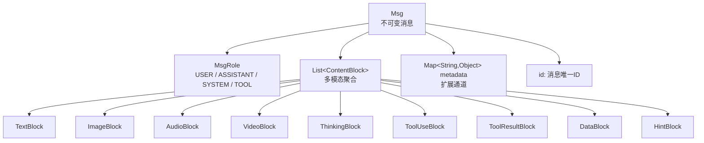

# Ch03 · 消息模型 `Msg` 与 `ContentBlock`

> 状态：🔲 · 预计时长：2h · 前置：Ch02

## 1. 本章目标

- 掌握 `Msg` 不可变聚合根的设计
- 区分 **9 种** `ContentBlock` 各自的使用场景
- 理解 `metadata` 通道（`MessageMetadataKeys`）的扩展机制
- 能用 Builder 拼出含**多模态 + 工具调用**的复杂消息

## 2. 核心概念

### 2.1 消息模型的两层抽象



**关键设计判断**：

- `Msg` **不可变**（所有字段 `final`），任何"修改"都返回新对象（`withContent` / `withGenerateReason` / `withReplyId` 等）
- 一个 `Msg` 含**多个** `ContentBlock`（一次响应可以同时含文本 + 工具调用）
- 元数据通过 `Map<String, Object>` 扩展，键名集中在 `MessageMetadataKeys`
- **`ContentBlock` 是 `sealed class`（`ContentBlock.java:58`）**——只有固定的 9 个 `final` 子类，**Java 17 sealed 特性**。这意味着：想新增一种 `ContentBlock` 必须修改父类的 `permits` 列表，**不是普通抽象类**

### 2.2 角色枚举

`agentscope-core/src/main/java/io/agentscope/core/message/MsgRole.java`：

```java
public enum MsgRole {
    USER,        // 用户输入
    ASSISTANT,   // 模型输出（含 thinking / tool_use）
    SYSTEM,      // 系统提示
    TOOL         // 工具结果（ToolResultMessage 的角色）
}
```

`TOOL` 是一个特殊角色 —— `ToolResultMessage` 实际是 `Msg` 的视图（看 `ToolResultMessage.java:92`），内部存的是 `ToolResultBlock`，role = TOOL。

### 2.3 **9 种** ContentBlock（外加 2 种 Source）

读 `agentscope-core/src/main/java/io/agentscope/core/message/`：

**ContentBlock 子类（9 种）**：

| Block | 用途 | 关键字段 |
|---|---|---|
| `TextBlock` | 文本内容 | `text` |
| `ImageBlock` | 图像 | `source: Base64Source \| URLSource` |
| `AudioBlock` | 音频 | `source` |
| `VideoBlock` | 视频 | `source` |
| `DataBlock` | 通用二进制 | `data`, `mimeType` |
| `ThinkingBlock` | 模型思维链 | `thinking` |
| `ToolUseBlock` | 模型发起的工具调用 | `id`, `name`, `input: Map` |
| `ToolResultBlock` | 工具执行结果 | `toolCallId`, `output: List<ContentBlock>`, `isError` |
| `HintBlock` | 提示/注入块 | `hint`（框架内部使用） |

**Source 子类（2 种，不是 ContentBlock）**：

| Source | 用途 | 关键字段 |
|---|---|---|
| `Base64Source` | 内联二进制源 | `data: byte[]`, `mimeType` |
| `URLSource` | URL 引用源 | `url` |

**关键纠正**：之前报告写"12 种 ContentBlock"是错的 —— 实际 **9 种 ContentBlock + 2 种 Source**。`Base64Source` / `URLSource` 是 `ImageBlock.source` 等字段的类型，不是 ContentBlock 子类。

### 2.4 metadata 扩展通道

`MessageMetadataKeys` 定义了**框架用**的元数据键：

```java
public final class MessageMetadataKeys {
    public static final String GENERATE_REASON = "generate_reason";
    public static final String CONFIRM_RESULTS = "confirm_results";
    public static final String TOOL_CALL_ID    = "tool_call_id";
    public static final String TOOL_CALL_NAME  = "tool_call_name";
    public static final String TOOL_GROUP      = "tool_group";
    public static final String INTERRUPT       = "interrupt";
    // ...
}
```

**业务侧建议**：

- ✅ 使用业务前缀（如 `myapp.tenant_id`）避免与框架冲突
- ✅ 字符串、枚举、数字、布尔可放
- ❌ 不要放大对象（POJO），保持可序列化

## 3. 源码精读

### 3.1 `Msg` 的不可变性

读 `agentscope-core/src/main/java/io/agentscope/core/message/Msg.java`：

```java
public final class Msg {
    // 1. 不可变字段
    private final String id;
    private final MsgRole role;
    private final String name;
    private final List<ContentBlock> content;
    private final Map<String, Object> metadata;
    // （共 5 个 final 字段，分布在 Msg.java 前段）

    // 2. Builder（L773 起步，在文件后段）
    public static class Builder {
        public Builder textContent(String text) { ... }            // 文本快路径
        public Builder content(List<ContentBlock> c) { ... }      // 多模态完整内容
        public Builder metadata(Map<String,Object> m) { ... }
        public Msg build() { ... }
    }

    public static Builder builder() { return new Builder(); }

    // 3. 不可变变体（注意：只有这 3 个，没有 withTextContent）
    public Msg withContent(List<ContentBlock> newContent) { ... }   // L663
    public Msg withGenerateReason(GenerateReason reason) { ... }    // L644
    public Msg withReplyId(String replyId) { ... }                  // L657
}
```

**关键纠正**（与之前报告相比）：
- **不存在** `withTextContent(String)` 方法
- **不存在** `withMetadata(String, Object)` 方法
- 对应能力通过 **`Builder.textContent(...)`** 和 **`Builder.metadata(...)`** 实现
- `Msg.java` **842 行** 的实际分布：1-200 主要是类声明 + 5 个字段 + 多个 `getXxx()`/`fromXxx()` 工厂；200-640 是 `MsgRole` 校验、`metadata` 序列化等方法；640-770 是 `withXxx` 变体（**只 3 个**）；**773 起是 Builder**（约 70 行）

**观察 1**：每次"修改"分配新 `List` / `Map`，绝不修改原对象。这让 Agent 的状态天然**线程安全**。

**观察 2**：构造器全 private，外部只能通过 `Builder` 创建。

### 3.2 工具调用的消息结构

一次完整的『模型发起工具调用 → 工具返回结果』涉及两个 Msg：

```java
// 1. 模型响应（role=ASSISTANT，含 ToolUseBlock）
Msg assistantMsg = Msg.builder()
    .role(MsgRole.ASSISTANT)
    .content(List.of(
        TextBlock.builder().text("让我查一下天气").build(),
        ToolUseBlock.builder()
            .id("call_abc123")
            .name("get_weather")
            .input(Map.of("city", "北京"))
            .build()
    ))
    .build();

// 2. 工具结果（role=TOOL，含 ToolResultBlock）
Msg toolMsg = Msg.builder()
    .role(MsgRole.TOOL)
    .content(List.of(
        ToolResultBlock.builder()
            .toolCallId("call_abc123")          // 关联到上面的 ToolUseBlock
            .name("get_weather")
            .output(List.of(TextBlock.builder().text("北京：晴，25℃").build()))
            .isError(false)
            .build()
    ))
    .build();
```

**关键约束**：`ToolResultBlock.toolCallId` 必须对应之前某个 `ToolUseBlock.id` —— 不然模型无法理解哪个结果对应哪个调用。

### 3.3 思维链的特殊性

`ThinkingBlock` 是 OpenAI o1 / Claude Sonnet 3.7+ 等"推理模型"的思维链：

```java
Msg reasoningMsg = Msg.builder()
    .role(MsgRole.ASSISTANT)
    .content(List.of(
        ThinkingBlock.builder()
            .thinking("用户问天气，但没说城市。我应该问还是猜？...")
            .build(),
        TextBlock.builder().text("请问您想查哪个城市的天气？").build()
    ))
    .build();
```

框架在 `formatter/openai` 中会把 `ThinkingBlock` 映射到 `reasoning_content` 字段，dashscope 映射到 `reasoning_content` 字段。

### 3.4 `ToolResultBlock.output` 的灵活性

`output` 类型是 `List<ContentBlock>` 而非 `String`：

```java
// 简单文本结果
ToolResultBlock.text("操作完成");

// 多模态结果：工具返回一张图
ToolResultBlock.builder()
    .toolCallId("call_xyz")
    .output(List.of(
        ImageBlock.builder().source(URLSource.of("https://example.com/chart.png")).build()
    ))
    .isError(false)
    .build();

// 错误结果
ToolResultBlock.builder()
    .toolCallId("call_err")
    .output(List.of(TextBlock.builder().text("参数缺失：city").build()))
    .isError(true)
    .build();
```

这让工具结果可以**携带图像、音频、文件**等富信息。

## 4. 设计权衡

| 选择 | 原因 | 替代方案 |
|---|---|---|
| `Msg` 不可变 | 状态可安全共享给多线程 | mutable POJO + 锁 |
| `content: List<ContentBlock>` | 支持多模态 + 工具混合 | 多个 String / Object 字段 |
| `output: List<ContentBlock>` | 工具结果可富信息 | `String` + 单独 error 字段 |
| `metadata: Map<String,Object>` | 框架 + 业务双层扩展 | 类型化字段（不够灵活） |
| `Msg` 通用，`ToolResultMessage` 是工具类 | 复用 Msg 协议栈 | 单独的类型（增加复杂度） |

## 5. 实验任务

详见 [`lab/ch03-build-msg.md`](../lab/ch03-build-msg.md)。核心：

1. 构造一个含 `TextBlock + ImageBlock` 的多模态消息
2. 构造一次完整的『用户 → 助手 + 工具调用 → 工具结果 → 助手』四 Msg 序列
3. 用 `withTextContent` 验证不可变性
4. 打印所有 `ContentBlock` 的 `toString` 验证结构

## 6. 思考题

1. 为什么不把 `ImageBlock` 直接合并到 `Msg` 字段，而是走 `ContentBlock` 抽象？
2. 如果工具调用 `id` 重复，框架会怎么处理？（提示：`ToolCallState.java`）
3. `metadata` 里能放 `LocalDateTime` 吗？序列化和反序列化有什么坑？

## 7. 参考资料

- 官方文档 building-blocks/message-and-event.md
- `docs/v2/en/docs/building-blocks/message-and-event.md`（约 396 行）
- Anthropic Messages API 对比：<https://docs.anthropic.com/en/api/messages>
- OpenAI Chat Completions 对比：<https://platform.openai.com/docs/api-reference/chat>

## 8. 学习笔记

在 `notes/ch03-my-takeaways.md` 写 3-5 条金句。

---

> 上一章：[Ch02](./ch02-reactive-foundation.md) · 下一章：[Ch04](./ch04-agent-and-state.md)
