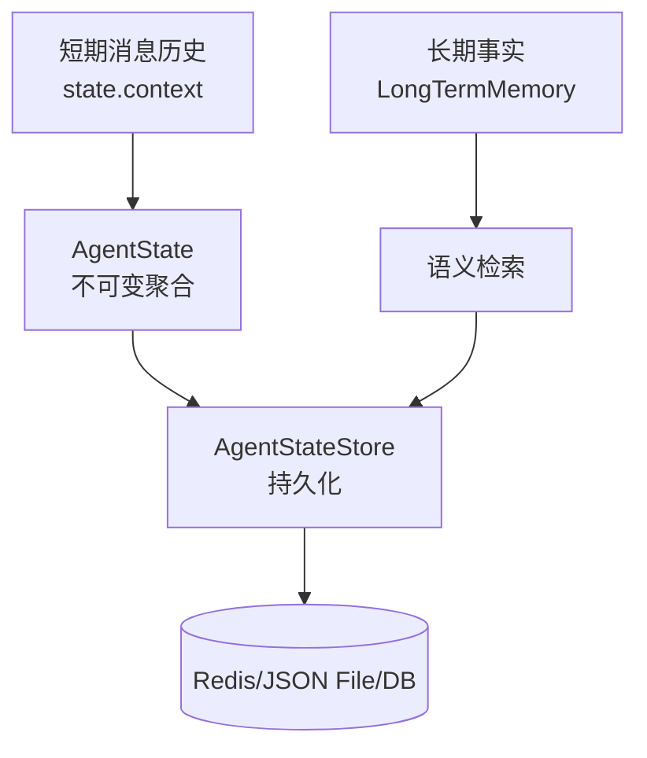

# Ch07 · 记忆与持久化

> 状态：🔲 · 预计时长：2.5h · 前置：Ch06

## 1. 本章目标

- 理解 `AgentStateStore` 抽象与两个内置实现（`InMemoryAgentStateStore` / `JsonFileAgentStateStore`）
- 理解 v1 `Memory` → v2 `AgentState` 的迁移路径
- 掌握 `LongTermMemory` 与 `LongTermMemoryMode` 三种模式
- 掌握 `StateBackedMemory` 适配器（旧接口兼容）

## 2. 核心概念

### 2.1 三层记忆体系



| 层 | 抽象 | 存储位置 |
|---|---|---|
| 短期 | `AgentState.context: List<Msg>` | `AgentStateStore` |
| 长期 | `LongTermMemory` | 独立存储 + 语义索引 |
| 工作 | `AgentState` 其他字段 | `AgentStateStore` |

### 2.2 `AgentStateStore` 接口

`agentscope-core/src/main/java/io/agentscope/core/state/AgentStateStore.java:61`：

```java
public interface AgentStateStore {
    // 加载单个 state
    <T extends State> Mono<T> load(String userId, String sessionId, String key, Class<T> type);

    // 加载某个 session 的所有 state
    <T extends State> Flux<T> loadAll(String userId, String sessionId, String key, Class<T> type);

    // 持久化单个
    Mono<Void> save(String userId, String sessionId, String key, State value);

    // 持久化多个
    Mono<Void> save(String userId, String sessionId, String key, List<? extends State> values);
}
```

**设计要点**：

- 4 个方法的 `Mono` / `Flux` 返回 —— **异步**，适配 Redis / DB
- 键是 `(userId, sessionId, key)` 三元组
- `State` 是一个标记接口，`AgentState` 实现它

### 2.3 内置实现

#### `InMemoryAgentStateStore`

`state/InMemoryAgentStateStore.java`：

- `ConcurrentHashMap<String, State>` —— 纯内存
- 进程重启**丢失**
- 适合单元测试

#### `JsonFileAgentStateStore`

`state/JsonFileAgentStateStore.java`：

- 写到本地 JSON 文件，默认路径 `~/.agentscope/state/<agentId>/<userId>/<sessionId>/`
- 用 Jackson 序列化整个 `AgentState`
- 单机部署可用

**默认路径结构**：

```
~/.agentscope/state/
└── <agentId>/
    └── <userId>/
        └── <sessionId>/
            └── agent_state.json
```

#### `RedisAgentStateStore`（extensions-redis）

`agentscope-extensions/agentscope-extensions-redis/`：

- 分布式场景
- Key 设计同上

### 2.4 v1 `Memory` 迁移

```java
// v1
Memory mem = new InMemoryMemory();
mem.saveTo(stateStore, "alice", "demo");
mem.loadFrom(stateStore, "alice", "demo");
List<Msg> msgs = mem.getMessages();

// v2 推荐
AgentStateStore store = new JsonFileAgentStateStore();
Mono<AgentState> state = store.load("alice", "demo", "agent_state", AgentState.class);
```

`StateBackedMemory` 是过渡期的**桥接类**：

```java
public class StateBackedMemory implements Memory {
    private final AgentStateStore store;
    private final String userId, sessionId;

    public List<Msg> getMessages() {
        // 实际从 store.load(...) 取
    }
}
```

### 2.5 `LongTermMemory` 长期记忆

`memory/LongTermMemory.java:71`：

```java
public interface LongTermMemory {
    Mono<Void> record(Msg message);     // 记录一条事实
    Flux<Knowledge> retrieve(String query, int limit);  // 语义检索
    Mono<Void> clear();                  // 清除
}
```

**实现位置**：

- `agentscope-extensions/agentscope-extensions-mem/`：基于向量数据库的实现

### 2.6 `LongTermMemoryMode` 三种模式

`memory/LongTermMemoryMode.java:54`：

```java
public enum LongTermMemoryMode {
    AGENT_CONTROL,   // Agent 通过工具自主管理（注册 LongTermMemoryTools）
    STATIC_CONTROL,  // 框架自动管理（StaticLongTermMemoryHook）
    BOTH             // 二者结合（推荐）
}
```

| 模式 | Agent 能调用工具吗 | 框架自动记录吗 | 适用 |
|---|---|---|---|
| `AGENT_CONTROL` | ✅ | ❌ | 高级 Agent，模型理解何时该记 |
| `STATIC_CONTROL` | ❌ | ✅ | 简单场景，强制全量记录 |
| `BOTH` | ✅ | ✅ | **推荐默认** |

## 3. 源码精读

### 3.1 `JsonFileAgentStateStore` 的文件布局

读 `state/JsonFileAgentStateStore.java:99-200`：

```java
public Mono<Void> save(String userId, String sessionId, String key, State value) {
    return Mono.fromCallable(() -> {
        Path dir = resolveDir(userId, sessionId, key);  // ~/.agentscope/state/agent/u/s/
        Files.createDirectories(dir);
        Path file = dir.resolve(key + ".json");

        // 写时复制：写到临时文件，原子重命名
        Path tmp = file.resolveSibling(file.getFileName() + ".tmp");
        Files.writeString(tmp, JsonCodec.encode(value));
        Files.move(tmp, file, ATOMIC_MOVE);

        return null;
    }).subscribeOn(Schedulers.boundedElastic());
}
```

**观察 1**：写时复制 + 原子重命名 —— 防止写到一半崩溃导致损坏。

**观察 2**：`subscribeOn(boundedElastic)` —— 文件 IO 异步化（看 Ch02 反模式警告）。

### 3.2 `AgentState` 序列化

`AgentState` 实现 `State` 接口，依赖 Jackson 注解（`@JsonProperty`）。读 `state/AgentState.java:100-200` 看字段。

**关键字段**：

- `context: List<Msg>` —— 消息历史
- `summary: String` —— 长期对话压缩后的摘要
- `curIter: int` —— 当前迭代次数（用于恢复执行）
- `permissionContext: PermissionContextState`
- `toolContext: ToolContextState`
- `tasksContext: TaskContextState`

### 3.3 `StaticLongTermMemoryHook` 自动记录

`memory/StaticLongTermMemoryHook.java:231`：

```java
public class StaticLongTermMemoryHook implements Hook {
    private final LongTermMemory memory;
    private int counter = 0;

    @Override
    public Mono<HookEvent> onPostCall(...) {
        // 每 N 条消息自动记录一次
        counter++;
        if (counter >= 10) {
            return memory.record(currentMsg).then(Mono.just(event));
        }
        return Mono.just(event);
    }
}
```

**观察**：通过 Hook 实现『框架自动记录』，业务侧零侵入。

## 4. 设计权衡

| 选择 | 原因 |
|---|---|
| v1 Memory 标记 deprecated 但保留 | 不破坏 v1 用户 |
| `State` 接口做标记 | 多态序列化 |
| 文件路径默认 `~/.agentscope/state/...` | 跨平台、隔离 workspace |
| 写时复制 + 原子重命名 | 防止崩溃损坏 |
| LongTermMemory 三种模式 | 灵活度 vs 自动化 |
| 持久化放 store 不放 Agent | Agent 是无状态的，可水平扩展 |

## 5. 实验任务

详见 [`lab/ch07-persistence-and-long-term-memory.md`](../lab/ch07-persistence-and-long-term-memory.md)。核心：

1. 跑两次 `agent.call(...)` 同一个 sessionId，验证 state 自动恢复
2. 杀掉进程重启，再次 `call`，验证 state 从 JSON 文件加载
3. 注册一个 `StaticLongTermMemoryHook`，跑 10 轮看自动记录

## 6. 思考题

1. 如果用 `JsonFileAgentStateStore` 部署在多实例上，会出现什么问题？
2. `AgentState` 里有 `permissionContext`，如果用户 A 的权限设置会污染用户 B 吗？
3. 长期记忆和短期记忆有重复时，如何去重？

## 7. 参考资料

- `docs/v2/en/docs/building-blocks/context.md`（约 296 行）
- `docs/v2/en/docs/harness/memory.md`（约 265 行）
- Jackson 序列化：<https://github.com/FasterXML/jackson-docs>

## 8. 学习笔记

在 `notes/ch07-my-takeaways.md` 写 3-5 条金句。

---

> 上一章：[Ch06](./ch06-toolkit-and-function-calling.md) · 下一章：[Ch08](./ch08-middleware-and-hooks.md)
