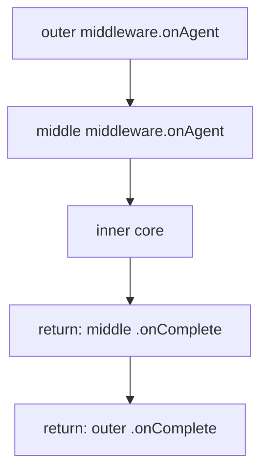
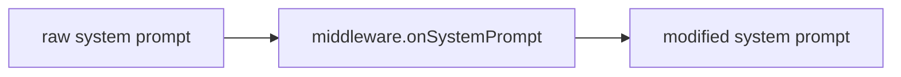

# Ch08 · 中间件与 Hook 系统

> 状态：🔲 · 预计时长：2.5h · 前置：Ch07

## 1. 本章目标

- 理解 `MiddlewareBase` 的 5 个钩子（`onAgent` / `onReasoning` / `onActing` / `onModelCall` / `onSystemPrompt`）
- 理解洋葱模型（Onion Pattern）与责任链模式
- 理解 v1 `Hook` 接口已 `@Deprecated forRemoval`，业务侧应迁移到 `MiddlewareBase`
- 能写一个 Token 统计 + 耗时统计 Middleware

## 2. 核心概念

### 2.1 Middleware vs Hook：v2 现状

`hook/HookEventType.java:26`：

```java
@Deprecated(forRemoval = true, since = "2.0.0")
public enum HookEventType { ... }
```

**重要**：

- v1 `Hook` 接口（`@Deprecated`）保留向后兼容
- v2 推荐用 `MiddlewareBase`（更强大，能**包裹**核心逻辑）
- 新代码**不要再用** `Hook`

### 2.2 `MiddlewareBase` 的 5 个钩子

读 `middleware/MiddlewareBase.java`：

| 钩子 | 时机 | 签名 | 模式 |
|---|---|---|---|
| `onAgent` | 整个 agent 调用的最外层 | `Flux<AgentEvent>` | 洋葱 |
| `onReasoning` | 单轮 reasoning 阶段 | `Flux<AgentEvent>` | 洋葱 |
| `onActing` | 工具调用阶段 | `Flux<AgentEvent>` | 洋葱 |
| `onModelCall` | 原始模型 API 调用 | `Flux<ChatResponse>` | 洋葱 |
| `onSystemPrompt` | 系统消息拼装 | `String` | 转换器 |

**洋葱模型**（4 个钩子）：



**转换器**（1 个钩子）：



### 2.3 `MiddlewareChain.build` 链式构造

读 `middleware/MiddlewareChain.java:46-58`：

```java
public static <I> Function<I, Flux<AgentEvent>> build(
    List<? extends MiddlewareBase> middlewares,         // 注意：List<? extends MiddlewareBase>
    Agent agent,
    RuntimeContext ctx,
    MiddlewareMethod<I> method,                          // 注意：函数式接口，不是 BiFunction
    Function<I, Flux<AgentEvent>> core
) {
    Function<I, Flux<AgentEvent>> chain = core;
    // 反向 wrap：最后一个 middleware 最先包裹
    for (int i = middlewares.size() - 1; i >= 0; i--) {
        MiddlewareBase mw = middlewares.get(i);
        chain = method.wrap(mw, chain);
    }
    return chain;
}
```

`MiddlewareMethod<I>` 是一个**函数式接口**（不是 `BiFunction`），定义：

```java
@FunctionalInterface
public interface MiddlewareMethod<I> {
    Function<I, Flux<AgentEvent>> wrap(
        MiddlewareBase mw,
        Function<I, Flux<AgentEvent>> next);
}
```

**关键**：

- 多个 middleware 形成**洋葱**链
- 第一个注册的 middleware **最外层**（最先入，最后出）
- 任何一个 middleware 都可以**短路**（不调 `next.apply(input)`）

### 2.4 `onSystemPrompt` 的特殊性

```java
// 注意：返回 Mono<String>，不是 String
default Mono<String> onSystemPrompt(Agent agent, RuntimeContext ctx, String systemPrompt) {
    return Mono.just(systemPrompt);  // 默认透传
}
```

这是**唯一**非 Flux 钩子，多个 middleware 串行转换。**实际组合方式不是 `Stream.reduce`**：

```java
// ReActAgent.applySystemPromptMiddlewares (L558-592)
Mono<String> result = Mono.just(rawPrompt);
for (MiddlewareBase mw : middlewares) {
    result = result.flatMap(p -> mw.onSystemPrompt(this, ctx, p));
}
// 最后一个 .block() 同步取结果
String finalPrompt = result.block();
```

**关键纠正**（与之前报告相比）：
- 返回类型是 `Mono<String>`，**不是** `String`
- 组合方式用 `for` 循环 + `flatMap`，**不是** `Stream.reduce`
- 最后一步是 `.block()` 同步取结果（因为 system prompt 在模型调用前必须就绪）

**用途**：

- 注入用户偏好
- 附加当前时间
- 添加技能描述

### 2.5 典型应用场景

| 场景 | 用哪个钩子 |
|---|---|
| Token 计数 | `onModelCall`（最准，看流式返回的 usage） |
| 限流 | `onAgent`（最外层，决定要不要让请求进） |
| 日志 | `onAgent`（最外层，看到完整生命周期） |
| 上下文裁剪 | `onReasoning`（改 `messages` 列表） |
| 重试 | `onModelCall`（捕获异常，retry） |
| 缓存 | `onModelCall`（同样的 input 直接命中缓存） |
| 用户偏好注入 | `onSystemPrompt` |

## 3. 源码精读

### 3.1 框架自带的 Middleware

| 类 | 作用 |
|---|---|
| `OtelTracingMiddleware` | 集成 OpenTelemetry（`tracing/`） |
| `GracefulShutdownMiddleware` | 拦截 `GracefulShutdownManager` 的 stop 信号（`shutdown/`） |
| `TaskReminderMiddleware` | 每 N 步提醒 Agent 看任务清单 |
| `DynamicSkillMiddleware` | 动态加载技能包 |
| `RagHook` | （旧）RAG 检索增强（已迁到 `Knowledge`） |

### 3.2 `MiddlewareChain.build` 详解

看 `ReActAgent.java:1880-1896` 中调用：

```java
Function<ReasoningInput, Flux<AgentEvent>> reasoningCore = ri -> reasoningStream(...);
Flux<AgentEvent> stream = MiddlewareChain.build(
    middlewares, ReActAgent.this, rc,
    MiddlewareBase::onReasoning,    // 钩子函数
    reasoningCore                    // 核心
).apply(new ReasoningInput(modelInput, tools, options));
```

**理解**：

- `MiddlewareChain.build` 返回的 `Function<I, Flux<O>>` 是**封装好**的 chain
- `.apply(input)` 触发整条链
- 链的最里层是 `reasoningCore`，往外是 `middlewares[0].onReasoning` → ... → `middlewares[N-1].onReasoning`

### 3.3 短路 Middleware 示例

```java
MiddlewareBase cacheMiddleware = new MiddlewareBase() {
    private final Map<String, Flux<ChatResponse>> cache = new ConcurrentHashMap<>();

    @Override
    public Flux<AgentEvent> onReasoning(
            Agent agent, RuntimeContext ctx, ReasoningInput input,
            Function<ReasoningInput, Flux<AgentEvent>> next) {
        String key = input.messages().toString();
        if (cache.containsKey(key)) {
            // 短路：直接返回缓存，不调 next
            return cache.get(key);
        }
        return next.apply(input).doOnNext(/* 写入缓存 */);
    }
};
```

## 4. 设计权衡

| 选择 | 原因 |
|---|---|
| Middleware 替代 Hook | 洋葱模型能**包裹**逻辑（重试、缓存、限流），Hook 只能**观察** |
| 5 个钩子（不是 1 个泛型） | 强类型 `I` 让用户写代码时不需要 cast |
| 反向 wrap（最后注册的最外层） | 符合直觉：先注册的先观察完整流程 |
| `onSystemPrompt` 独立 | 它是纯函数式转换，不适合洋葱 |
| v1 Hook 标记 deprecated | 引导用户迁移，但保留兼容 |

## 5. 实验任务

详见 [`lab/ch08-custom-hook-middleware.md`](../lab/ch08-custom-hook-middleware.md)。核心：

1. 写一个 `TimingMiddleware`（`onAgent`），打印每次调用的总耗时
2. 写一个 `TokenCounterMiddleware`（`onModelCall`），累加 token 用量
3. 写一个 `ContextSanitizerMiddleware`（`onReasoning`），脱敏消息中的手机号
4. 写一个 `SkillInjectorMiddleware`（`onSystemPrompt`），在 system prompt 末尾追加当前时间

## 6. 思考题

1. 两个 Middleware 都 `onAgent` 包裹，第一个注册的在外还是在内？
2. `onModelCall` 拿到的 `Flux<ChatResponse>` 是原始 LLM 返回还是被中间件修改过的？
3. 写一个 Middleware 拦截『用户消息含敏感词』，直接返回"已拒绝" —— 用哪个钩子最合适？

## 7. 参考资料

- 洋葱模型：<https://github.com/koajs/compose>（Koa.js 经典实现）
- `docs/v2/en/docs/building-blocks/middleware.md`（约 391 行，**必读**）
- `agentscope-core/src/main/java/io/agentscope/core/middleware/` 全部源码

## 8. 学习笔记

在 `notes/ch08-my-takeaways.md` 写 3-5 条金句。

---

> 上一章：[Ch07](./ch07-memory-and-persistence.md) · 下一章：[Ch09](./ch09-structured-output-and-formatter.md)
