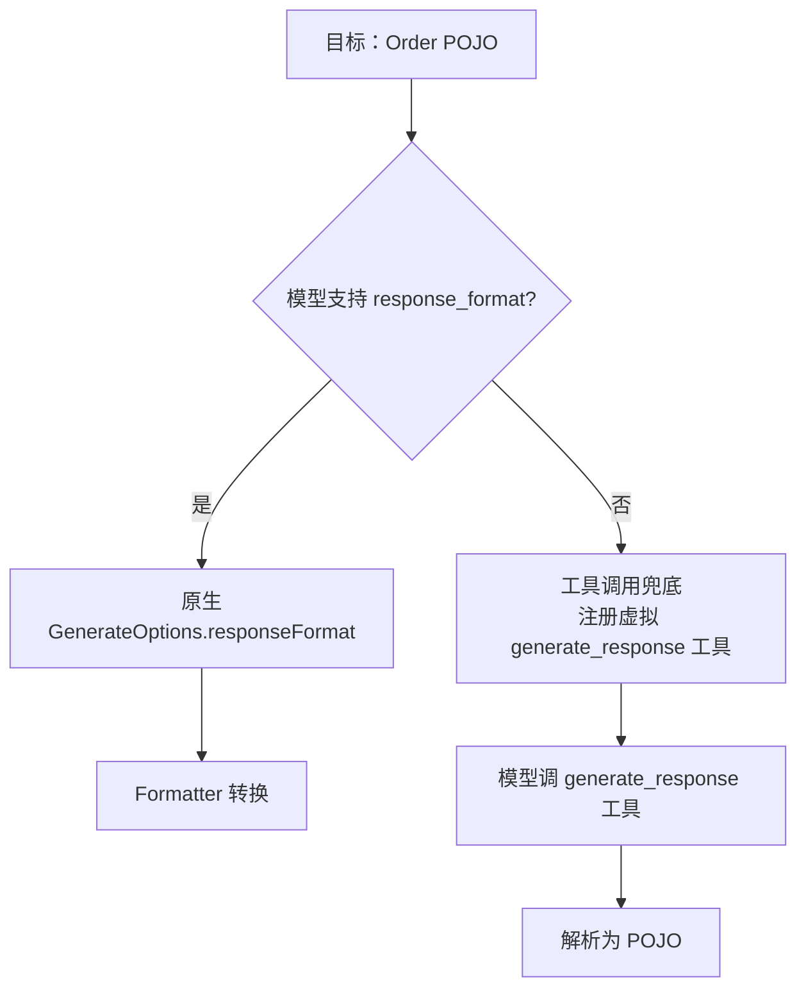

# Ch09 · 结构化输出与 Formatter

> 状态：🔲 · 预计时长：2h · 前置：Ch08

## 1. 本章目标

- 理解 `ResponseFormat` + `StructuredOutputReminder` 的作用
- 掌握 `Formatter` 抽象与 5 家实现（openai / dashscope / anthropic / gemini / ollama）
- 理解结构化输出的两种实现路径：**工具调用兜底** vs **原生 response_format**
- 能让 Agent 输出固定 POJO（如 `Order`）

## 2. 核心概念

### 2.1 两种结构化输出路径



| 维度 | 原生 | 工具调用兜底 |
|---|---|---|
| 支持模型 | OpenAI（json_schema）、Gemini、Anthropic（部分） | 所有支持 function calling 的 |
| 可靠性 | 高 | 中（模型可能不调） |
| 性能 | 优 | 需多一轮 |

### 2.2 `ResponseFormat`

`formatter/ResponseFormat.java`：

```java
public class ResponseFormat {
    private final String type;            // "json_object" | "json_schema"
    private final String jsonSchema;      // 完整 JSON Schema
    private final boolean strict;         // 是否严格
    // ...
}
```

**使用**：

```java
GenerateOptions opts = GenerateOptions.builder()
    .responseFormat(ResponseFormat.builder()
        .type("json_schema")
        .jsonSchema(orderSchema)  // Order 的 JSON Schema 字符串
        .strict(true)
        .build())
    .build();
```

### 2.3 `StructuredOutputReminder` 提示工程

`model/StructuredOutputReminder.java`：

当**没有**原生 response_format 时，框架会**自动**在 system prompt 末尾追加一段提示：

```
[结构化输出提醒]
请仅输出符合以下 JSON Schema 的有效 JSON：
{...}
不要包含其他文字。
```

这大大提高了模型遵循 schema 的概率。

### 2.4 `Formatter` 抽象（**泛型接口**）

`formatter/Formatter.java`（**实际是泛型接口，不是简单 3 方法**）：

```java
public interface Formatter<TReq, TResp, TParams> {
    // TReq:  provider-specific 请求消息类型
    // TResp: provider-specific 响应类型
    // TParams: provider-specific 请求参数 builder 类型

    List<TReq> format(List<Msg> msgs);

    ChatResponse parseResponse(TResp response, Instant startTime);

    void applyOptions(
            TParams paramsBuilder, GenerateOptions options, GenerateOptions defaultOptions);

    void applyTools(TParams paramsBuilder, List<ToolSchema> tools);
}
```

**关键纠正（与之前报告相比）**：
- `Formatter` 是 **`Formatter<TReq, TResp, TParams>` 泛型接口**，不是普通 3 方法接口
- 4 个方法：`format` / `parseResponse` / `applyOptions` / `applyTools`
- `parseStream(Flux<String>)` / `parseNonStream(String)` **不存在**——实际是非流式响应直接走 `parseResponse(TResp, Instant)`；流式逻辑在 ChatModel 层而非 Formatter 层
- 业务侧**一般不直接用 Formatter**——它是 Model 实现之间的内部接口

**5 家实现**：

| 实现 | 路径 | 泛型参数 | 特点 |
|---|---|---|---|
| OpenAI | `formatter/openai/` | `<ChatCompletionMessageParam, ChatCompletion, ChatCompletionCreateParams.Builder>` | `chat/completions` 协议、function calling、tools |
| DashScope | `formatter/dashscope/` | `<Message, GenerationResult, GenerationParam>` | 通义千问、`reasoning_content` 字段 |
| Anthropic | `formatter/anthropic/` | `<MessageParam, Message, MessageCreateParams>` | Claude `messages` API、独立的 system |
| Gemini | `formatter/gemini/` | `<Content, GenerateContentResponse, GenerateContentConfig>` | Google `generateContent` |
| Ollama | `formatter/ollama/` | OpenAI 兼容 | 本地模型，OpenAI 兼容 |

**设计意图**：模型不同 = 协议不同，但 Agent 代码**统一**。Formatter 是适配器层。

### 2.5 结构化输出主流程

```java
// 用户角度
Order order = reActAgent.call(...)
    .map(msg -> parseOrder(msg))    // 用 Jackson
    .block();
```

```java
// 框架内部
1. 用 ToolSchemaGenerator.generate(Order.class) 生成 JSON Schema
2. 构造 GenerateOptions.responseFormat
3. 把 schema 注入 model call
4. 解析响应
5. 反序列化为 Order POJO
```

## 3. 源码精读

### 3.1 结构化输出：两条调用路径

**重要**：`ReActAgent.Builder` **没有** `structuredOutput(Class)` 方法——之前报告里"`ReActAgent.builder().structuredOutput(Order.class).build()`"用法**不存在**。

实际 v2 走结构化输出有**两条路径**：

#### 路径 1：用 `call()` 的重载（推荐）

`ReActAgent.java:631-636`：

```java
public Mono<Msg> call(List<Msg> msgs, Class<?> structuredOutputClass, RuntimeContext context) {
    return callInternal(msgs, context, m -> doCall(m, structuredOutputClass));
}

public Mono<Msg> call(List<Msg> msgs, JsonNode outputSchema, RuntimeContext context) {
    return callInternal(msgs, context, m -> doCall(m, outputSchema));
}
```

`doCall(msgs, Class<?>)` 在 `ReActAgent.java:954`：

```java
protected Mono<Msg> doCall(List<Msg> msgs, Class<?> structuredOutputClass) {
    return doStructuredCall(msgs, structuredOutputClass, null);
}
```

#### 路径 2：自己生成 schema 后传 `JsonNode`（高级用法）

`ReActAgent.java:959-` 的 `doCall(List<Msg>, JsonNode)` 重载。

**Schema 生成走 `JsonSchemaUtils`**（**注意方法名**）：

```java
// JsonSchemaUtils.java:96 - 接收 Class<?> 时用这个
public static Map<String, Object> generateSchemaFromClass(Class<?> clazz)

// JsonSchemaUtils.java:131 - 接收 Type 时用这个
public static Map<String, Object> generateSchemaFromType(Type type)
```

**关键纠正（与之前报告相比）**：
- `generateSchemaFromType(Class)` 是**错方法名**——传 `Class<?>` 应调用 `generateSchemaFromClass(Class<?>)`（L96）
- `generateSchemaFromType(Type)`（L131）是给**参数化类型**（如 `List<Order>`）用的

**关键**：

- 如果模型支持原生 `response_format` → 设置 `options.responseFormat` 优先
- 否则 → 注册虚拟工具强制走工具调用

### 3.2 `ToolSchemaGenerator` 实际是**包私有类**

`tool/ToolSchemaGenerator.java`（**实际 152 行，包私有类**）：

```java
// 注意：是包私有类，没有 public 修饰符
class ToolSchemaGenerator {

    // 注意：也是包私有方法，不是 public static
    Map<String, Object> generateParameterSchema(Method method, Set<String> excludeParams) { ... }
}
```

**关键纠正（与之前报告相比）**：
- `ToolSchemaGenerator` 类**不带 `public`**——是**包私有**（`io.agentscope.core.tool` 包内可见）
- `generateParameterSchema` 方法**也不带 `public static`**——同样是包私有
- **不存在** `generate(Method)` 重载
- **不存在** `generate(Class<?>)` 重载
- 业务侧**不能直接调用** `ToolSchemaGenerator.generateParameterSchema(...)`——它只供框架内部使用
- 业务侧想生成工具参数 schema 只能走 `JsonSchemaUtils.generateSchemaFromClass(...)`（**Class 用 `fromClass`，Type 用 `fromType`**，不要混）

实际工具注册流程（`Toolkit.registerTool(...)` 内部）：

```java
// 框架内部
Map<String,Object> schema = new ToolSchemaGenerator().generateParameterSchema(method, excludeParams);
// 然后把 schema 注入 ReflectiveFunctionTool
```

### 3.3 `Formatter` 实现精要

读 `formatter/openai/OpenAIFormatter.java`（约 200 行）核心：

```java
public FormattedRequest format(List<Msg> messages, List<ToolSchema> tools, GenerateOptions options) {
    OpenAIRequest req = new OpenAIRequest();
    req.model = options.getModelName();
    req.messages = messages.stream().map(this::toOpenAIMessage).toList();
    req.tools = tools.stream().map(this::toOpenAITool).toList();

    if (options.getResponseFormat() != null) {
        req.response_format = toOpenAIResponseFormat(options.getResponseFormat());
    }
    return new FormattedRequest(JsonCodec.encode(req), options);
}
```

`parseStream` 把 SSE 流（`data: {...}\n\n`）解析为 `Flux<ChatResponse>`。

### 3.4 `MediaUtils` 处理多模态

`formatter/MediaUtils.java`：

- 图像 / 音频 / 视频 → 各家协议字段映射
- OpenAI：`image_url` 类型 content part
- Anthropic：`source: {type: base64, media_type, data}`
- Gemini：`inline_data: {mime_type, data}`

## 4. 设计权衡

| 选择 | 原因 |
|---|---|
| `Formatter` 抽象独立于 `ChatModel` | 同一模型可能有多个协议（OpenAI 兼容 / 原生） |
| 双路径（原生 + 工具兜底） | 兼容所有模型 |
| `StructuredOutputReminder` 自动追加 | 减少用户心智负担 |
| 强类型 `Class<T>` 而非 `Map` | 编译期检查 |
| 工具调用兜底走 `ToolChoice.SPECIFIC` | 强制模型走结构化输出 |

## 5. 实验任务

详见 [`lab/ch09-structured-output.md`](../lab/ch09-structured-output.md)。核心：

1. 定义 `Order` POJO（`@JsonProperty` + `@JsonPropertyDescription`）
2. 让 Agent 输出 `Order` 并自动反序列化
3. 对比原生 vs 工具调用兜底的实现差异
4. 验证结构化输出在 `AgentState.context` 中的存储形式

## 6. 思考题

1. 如果模型输出的 JSON 缺字段，反序列化会怎样？框架有保护吗？
2. `strict=true` 在 OpenAI 和 Anthropic 上行为一致吗？
3. `ToolChoice.SPECIFIC` 和 `ToolChoice.AUTO` 在结构化输出场景下有什么区别？

## 7. 参考资料

- `docs/v2/en/docs/building-blocks/model.md`（约 342 行）
- OpenAI Structured Outputs：<https://platform.openai.com/docs/guides/structured-outputs>
- Anthropic Tool Use：<https://docs.anthropic.com/en/docs/tool-use>
- JSON Schema 规范：<https://json-schema.org/draft/2020-12/schema>

## 8. 学习笔记

在 `notes/ch09-my-takeaways.md` 写 3-5 条金句。

---

> 上一章：[Ch08](./ch08-middleware-and-hooks.md) · 下一章：[Ch10](./ch10-multi-agent-and-harness.md)
