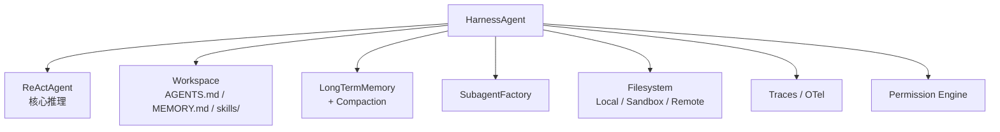

# Ch10 · 多 Agent 编排与 `HarnessAgent`

> 状态：🔲 · 预计时长：3h · 前置：Ch09

## 1. 本章目标

- 理解子 Agent（`SubAgent` / `SubagentFactory`）作为"工具"的本质
- 掌握 `HarnessAgent` 的工程增强层（Workspace / 长期记忆 / 沙箱 / 技能 / A2A）
- 能构建『主 Agent + 多个子 Agent』的协作流水线
- 理解本地 vs 远程子 Agent（`RemoteSubagentStub`）的区别

## 2. 核心概念

### 2.1 子 Agent 的核心洞察

> **子 Agent 就是一个『工具』**。

子 Agent 通过 `SubAgentConfig` 暴露给主 Agent 作为工具：

```java
SubAgentConfig config = SubAgentConfig.builder()
    .name("researcher")
    .description("负责检索资料")
    .agent(researcherAgent)
    .build();

toolkit.registerSubAgent(config);
// 主 Agent 自动看到一个工具：call_researcher(message, conversation_id)
```

**优势**：

- 主 Agent 不知道它是 Agent，只知道是个工具
- 子 Agent 有**自己**的 ReAct 循环、状态、模型
- 通过 `conversation_id` 支持多轮对话

### 2.2 `SubAgentConfig` 关键字段

`tool/subagent/SubAgentConfig.java:94`：

| 字段 | 作用 |
|---|---|
| `agent` | 子 Agent 实例（任何 `Agent`） |
| `name` | 工具名前缀（默认 `call_<agentName>`） |
| `description` | 工具描述（主 Agent 看到的元数据） |
| `forwardEvents` | 子 Agent 的事件是否转发到主 Agent 事件流 |
| `streamOptions` | 子 Agent 流式配置 |
| `stateStore` | 子 Agent 的 state 存储（默认 InMemoryAgentStateStore） |

### 2.3 `HarnessAgent` 的整车能力

`agentscope-harness/src/main/java/io/agentscope/harness/agent/HarnessAgent.java`：



### 2.4 Workspace 目录布局

```
.agentscope/workspace/
├── AGENTS.md                    # 全局 persona（可选）
└── agents/
    └── <agentName>/
        ├── sessions/            # 原始对话日志
        ├── skills/              # 技能包
        ├── subagents/           # 子 Agent 声明
        ├── tools.json           # 工具配置
        └── memory/
            ├── 2026-06-29.md    # 每日事实
            └── MEMORY.md        # 长期事实汇总
```

### 2.5 远程子 Agent（A2A）

`harness/agent/subagent/RemoteSubagentStub.java`：

- 通过 **A2A 协议** 跨进程调用远端 Agent
- 注册到 Nacos / Consul 服务发现
- 调用时序列化 `Msg` → HTTP → 远端 → 响应

**应用**：把不同语言 / 不同团队的 Agent 拼成工作流。

## 3. 源码精读

### 3.1 `SubAgent` 工具注册流程

`tool/subagent/`（约 5 个文件）：

```java
// 框架内部：把 SubAgentConfig 包成 AgentTool
AgentTool tool = SubAgentTool.create(config);
toolkit.registerAgentTool(tool);
```

`SubAgentTool` 内部：

```java
public class SubAgentTool extends ToolBase {
    private final Agent subAgent;
    private final SubAgentConfig config;

    public Mono<ToolResultBlock> callAsync(ToolCallParam param) {
        String message = (String) param.getInput().get("message");
        String conversationId = (String) param.getInput().get("conversation_id");

        RuntimeContext subCtx = RuntimeContext.builder()
            .sessionId(conversationId != null ? conversationId : UUID.randomUUID().toString())
            .userId(parentCtx.getUserId())    // 继承 user
            .build();

        return subAgent.call(
            Msg.builder().role(MsgRole.USER).textContent(message).build(),
            subCtx
        ).map(msg -> ToolResultBlock.text(msg.getTextContent()));
    }
}
```

### 3.2 `HarnessAgent` 的工作目录

`harness/agent/HarnessAgent.java` 关键字段：

```java
public class HarnessAgent {
    private final ReActAgent coreAgent;
    private final Path workspace;
    private final AbstractFilesystem filesystem;
    private final AgentSkillRepository skillRepo;
    private final SubagentFactory subagentFactory;
    private final CompactionConfig compactionConfig;
    // ...
}
```

### 3.3 远程 SubAgent 与 A2A 协议

`harness/agent/subagent/RemoteSubagentStub.java` 关键：

```java
public class RemoteSubagentStub extends ToolBase {
    private final String endpoint;  // e.g., "http://other-service/agents/researcher"
    private final HttpClient http;

    public Mono<ToolResultBlock> callAsync(ToolCallParam param) {
        // 1. 序列化 Msg 为 A2A 协议格式
        A2ARequest req = toA2ARequest(param);
        // 2. HTTP POST
        return http.post(endpoint, req)
            .map(A2AResponse::toMsg)
            .map(msg -> ToolResultBlock.text(msg.getTextContent()));
    }
}
```

A2A 协议本质：HTTP + JSON 序列化 Agent 之间的对话。

### 3.4 `DefaultAgentManager` 调度

`harness/agent/subagent/DefaultAgentManager.java`：

- 维护"agent 名 → 实例"映射
- 解析 AGENTS.md / subagents/*.md 声明
- 按需懒加载子 Agent
- 缓存已加载实例

## 4. 设计权衡

| 选择 | 原因 |
|---|---|
| 子 Agent = 工具 | 主 Agent 无感，统一编排 |
| `conversation_id` 多轮 | 同一子 Agent 跨多轮保持上下文 |
| HarnessAgent 装饰者 | 可单独用 ReActAgent，也可用 HarnessAgent |
| Workspace 目录布局 | 配置文件随项目走，可 git 版本管理 |
| 远程子 Agent = 独立进程 | 不同语言团队可独立交付 |

## 5. 实验任务

详见 [`lab/ch10-multi-agent-orchestration.md`](../lab/ch10-multi-agent-orchestration.md)。核心：

1. 构建『研究员 + 写作者』两 Agent 协作
2. 主 Agent 通过 `call_researcher` 工具调子 Agent
3. 用 `conversation_id` 实现多轮子对话
4. （可选）构建一个最小的 `HarnessAgent` 实例

## 6. 思考题

1. 子 Agent 调子 Agent（嵌套）会无限递归吗？框架有什么保护？
2. 主 Agent 和子 Agent 用同一个 LLM 还是不同 LLM？
3. `forwardEvents=true` 对调试有什么帮助？对性能呢？

## 7. 参考资料

- `docs/v2/en/docs/harness/architecture.md`（约 81 行，**必读**）
- `docs/v2/en/docs/harness/subagent.md`（约 434 行）
- A2A 协议草案：<https://github.com/agentscope-ai/a2a-spec>
- MCP 协议：<https://modelcontextprotocol.io/>

## 8. 学习笔记

在 `notes/ch10-my-takeaways.md` 写 3-5 条金句。

---

> 上一章：[Ch09](./ch09-structured-output-and-formatter.md) · 下一章：[Ch11](./ch11-mcp-a2a-protocols.md)
