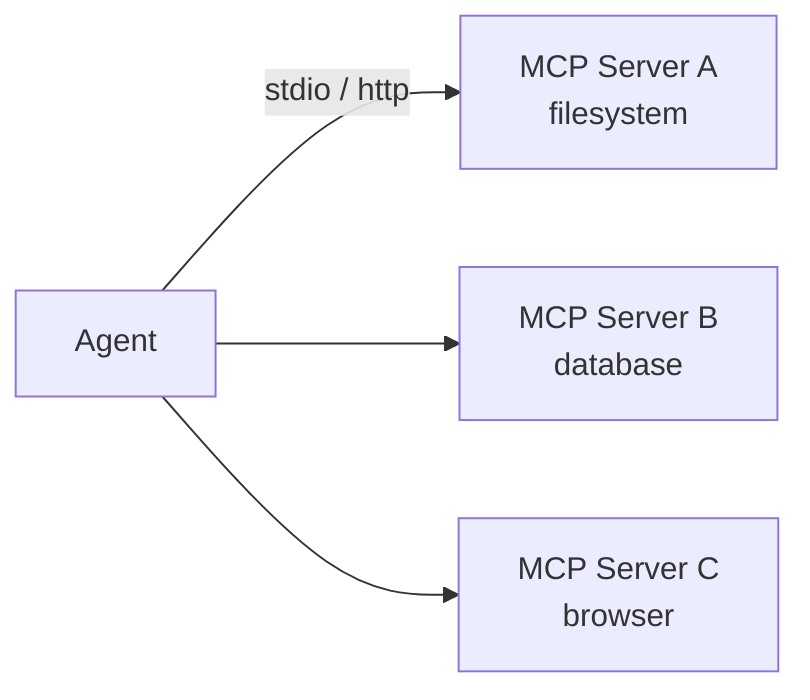
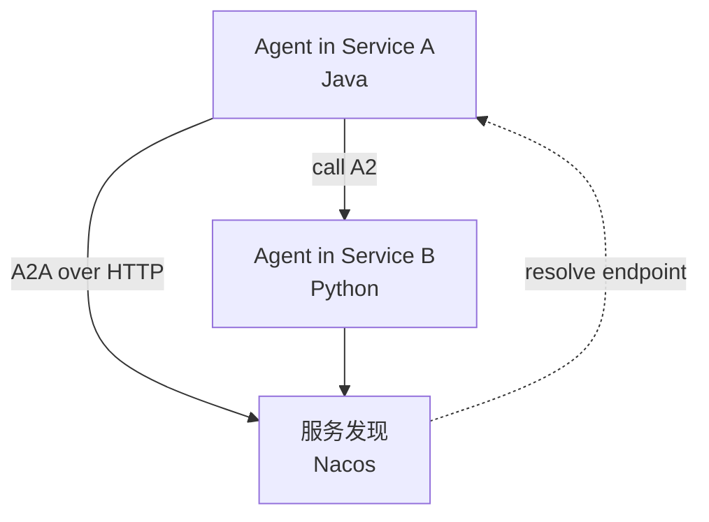

# Ch11 · MCP / A2A 协议接入（进阶）

> 状态：🔲 · 预计时长：2.5h · 前置：Ch10

## 1. 本章目标

- 理解 MCP（Model Context Protocol）的核心概念：tools / resources / prompts
- 理解 A2A（Agent-to-Agent）协议的目标
- 掌握 `McpClientBuilder` 注册 MCP server
- 掌握 `RemoteSubagentStub` 实现 A2A 远端调用
- 能接入官方 MCP filesystem server

## 2. 核心概念

### 2.1 MCP 是什么

**Model Context Protocol**（Anthropic 主导，2024）：

> 把"工具"标准化为协议，让任何 LLM 都能调用任何 MCP server。



**三种原语**：

| 原语 | 作用 | 类比 |
|---|---|---|
| `tools` | 可调用的函数 | `Tool` |
| `resources` | 可读取的数据（文件、URL） | 知识库 |
| `prompts` | 预设 prompt 模板 | 提示库 |

### 2.2 A2A 是什么

**Agent-to-Agent** 协议：

> 把"Agent 调用其他 Agent"标准化为协议，支持跨进程 / 跨语言 / 跨服务发现。



**关键能力**：

- 服务注册与发现
- Agent 能力声明（name / description / tools）
- 对话状态序列化
- 长任务 / 流式 / 同步多种模式

### 2.3 框架中的 MCP 集成

`agentscope-core/src/main/java/io/agentscope/core/tool/mcp/`：

- `McpClientBuilder`：注册 MCP server
- `McpClientManager`：管理多个 server 连接
- 接入流程：MCP server 的 tools 自动注册为 `ToolBase`（`mcp=true`）

```java
Toolkit tk = new Toolkit();
tk.registerMcpServer(McpClientBuilder.builder()
    .name("filesystem")
    .command("npx")
    .args(List.of("-y", "@modelcontextprotocol/server-filesystem", "/tmp"))
    .build());

// 之后：tk.getToolNames() 包含 read_file / write_file / list_directory ...
```

### 2.4 框架中的 A2A 集成

`agentscope-harness/.../subagent/RemoteSubagentStub.java`：

- 把远端 Agent 抽象为本地 `ToolBase`
- 通过 HTTP 调用 + 服务发现（Nacos）
- `SubagentDeclaration` 声明远端 Agent 能力

```java
toolkit.registerSubAgent(SubAgentConfig.builder()
    .name("remote-researcher")
    .agent(RemoteSubagentStub.builder()
        .endpoint("http://research-service/agents/researcher")
        .build())
    .build());
```

## 3. 源码精读

### 3.1 `McpClientBuilder` 的设计

`tool/mcp/McpClientBuilder.java`（实际 790 行）：

```java
public class McpClientBuilder {
    private String name;
    private TransportConfig transportConfig;     // command/args/endpoint 封装在这里
    private Duration requestTimeout;
    private Duration initializationTimeout;
    private ElicitationHandler asyncElicitationHandler;
    private ElicitationHandler syncElicitationHandler;
    private List<String> protocolVersions;
    // 注意：顶层没有 command/args/endpoint 字段
}
```

**`TransportConfig` 子类**（封装 transport 细节）：

| 子类 | 用途 | 关键字段 |
|---|---|---|
| `StdioTransportConfig` | stdio 模式 | `command`, `args` |
| `SseTransportConfig` | SSE/HTTP 模式 | `endpoint` |
| `StreamableHttpTransportConfig` | HTTP streamable 模式 | `endpoint` |

**两种连接方式**：

| 模式 | 用途 | 示例 |
|---|---|---|
| stdio | 启动子进程 | `npx -y @mcp/server-x` |
| HTTP/SSE | 连接远端 server | `http://mcp.internal/api` |

**注意**：之前报告里"McpClientBuilder.java:527"行号指向的是 `ProtocolVersionOverrideTransport` 的 Javadoc 段，**不是方法锚点**。

### 3.2 MCP 工具如何变成 ToolBase

```java
// 框架内部（伪代码）
List<McpTool> remoteTools = mcpClient.listTools();
for (McpTool rt : remoteTools) {
    ToolBase localTool = McpToolAdapter.builder()
        .name(rt.name)
        .description(rt.description)
        .inputSchema(rt.inputSchema)
        .mcp(serverName)
        .build();

    tk.registerAgentTool(localTool);
}
```

`McpToolAdapter` 在 `callAsync` 中通过 `mcpClient.callTool(name, args)` 转发。

### 3.3 `RemoteSubagentStub` 与 Nacos 集成

**关键纠正**：`RemoteSubagentStub`（`harness/agent/subagent/RemoteSubagentStub.java`，**54 行**）**不是 `ToolBase`，不直接持有 `NacosNamingService`**。它是一个 54 行的轻量 `AgentBase` 子类：

```java
public class RemoteSubagentStub extends AgentBase {
    private final String name;
    private final String description;
    // 没有 endpoint、httpClient、nacos 字段
}
```

真正的 Nacos 服务发现 + HTTP 调用在 **`agentscope-extensions-nacos-a2a`** 子模块里实现 —— `RemoteSubagentStub` 只是定义"远端子 Agent"这个**抽象角色**，由 Nacos 适配器层填充具体实现：

```
harness/agent/subagent/RemoteSubagentStub.java       # 抽象（54 行）
agentscope-extensions-nacos-a2a/.../NacosSubagentStub.java  # 具体实现
```

**优势**：

- 调用方不需知道 IP / 端口
- 服务端可弹性扩缩
- 健康检查由 Nacos 处理

### 3.4 `agentscope-extensions-nacos` 模块

`agentscope-extensions/agentscope-extensions-nacos/`：

- Nacos 客户端封装
- Agent 注册 / 注销
- 心跳保活
- 服务订阅

## 4. 设计权衡

| 选择 | 原因 |
|---|---|
| 协议层独立于 ChatModel | 不同模型可有不同协议（OpenAI 兼容 / Anthropic / Gemini） |
| MCP 用 adapter 模式 | 旧有 Tool 体系可平滑接入 |
| A2A 用 Tool 模式 | 主 Agent 无感 |
| Nacos 默认 | 阿里生态内网组件 |
| HTTP + JSON 序列化 | 跨语言友好 |

## 5. 实验任务

详见 [`lab/ch11-mcp-filesystem.md`](../lab/ch11-mcp-filesystem.md)。核心：

1. 启动官方 `@modelcontextprotocol/server-filesystem`
2. 用 `McpClientBuilder` 注册
3. 让 Agent 调用 `read_file` / `list_directory`
4. （可选）跑一个简单的 A2A 客户端

## 6. 思考题

1. MCP 和普通 Tool 注册有什么本质区别？
2. A2A 调用远端 Agent 时，状态怎么管理？本地还是远端？
3. 如果 MCP server 挂了，框架会怎样？有没有重连机制？

## 7. 参考资料

- `docs/v2/en/docs/integration/` 下的 MCP / A2A 文档
- MCP 官方：<https://modelcontextprotocol.io/>
- MCP server 列表：<https://github.com/modelcontextprotocol/servers>
- A2A 协议草案：见 `agentscope-extensions-protocol/`
- Nacos：<https://nacos.io/>

## 8. 学习笔记

在 `notes/ch11-my-takeaways.md` 写 3-5 条金句。

---

> 上一章：[Ch10](./ch10-multi-agent-and-harness.md) · 下一章：[Ch12](./ch12-production-observability.md)
