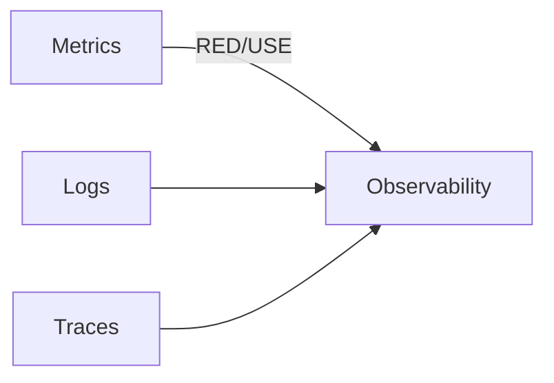
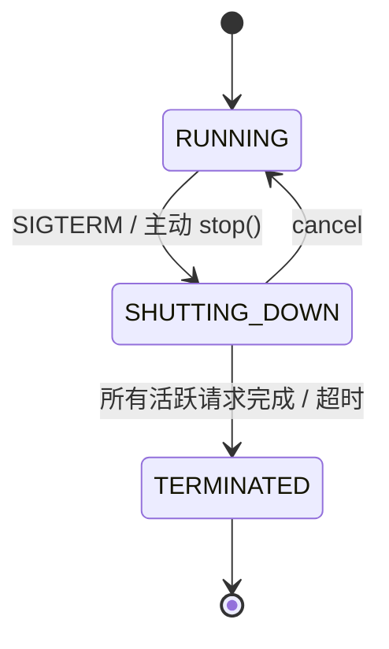
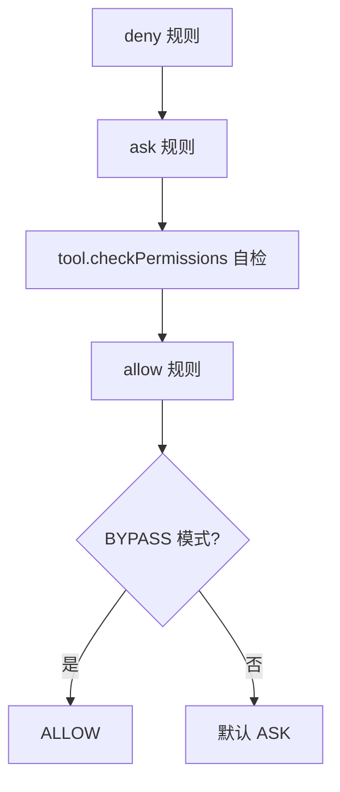

# Ch12 · 生产化：可观测性 / 优雅停机 / 权限系统（进阶）

> 状态：🔲 · 预计时长：2.5h · 前置：Ch11

## 1. 本章目标

- 掌握 `OtelTracingMiddleware` 集成 OpenTelemetry
- 掌握 `JsonlTraceExporter` 离线 trace 导出
- 理解 `GracefulShutdownManager` 的工作原理
- 理解 `PermissionEngine` 的多级权限决策
- 能用 trace 工具分析一次完整 ReAct 调用

## 2. 核心概念

### 2.1 可观测性三支柱



| 支柱 | 在框架中的位置 |
|---|---|
| **Traces** | `tracing/OtelTracingMiddleware` |
| **Metrics** | 通过 OTel / Spring Boot Actuator |
| **Logs** | SLF4J + Logback（无框架特殊处理） |

### 2.2 OpenTelemetry Middleware

`tracing/OtelTracingMiddleware.java`：

- 每次 agent 调创建一个 Root Span
- 嵌套 Span：reasoning / acting / tool_call / model_call
- 自动传播 trace context 到子 Agent / 工具

**Span 结构**：

```
agent.call
├── reasoning.iter0
│   ├── model.call
│   └── tool.read_file
│       └── mcp.request
├── reasoning.iter1
│   └── model.call
└── tool.write_file
```

### 2.3 `JsonlTraceExporter` 离线导出

`hook/recorder/JsonlTraceExporter.java`：

- 把所有 `AgentEvent` 写入 JSON Lines 文件
- 适合无 OTel collector 的环境
- 配合 `Hook` 实现

**格式**：

```json
{"timestamp": 1719600000000, "type": "AgentStartEvent", "replyId": "abc", "agent": "demo"}
{"timestamp": 1719600000010, "type": "PreReasoningEvent", "iter": 0}
...
```

### 2.4 优雅停机

`shutdown/GracefulShutdownManager.java`：



**关键点**：

- 正在执行的请求**不被 kill**，等它跑完
- 新请求**被拒绝**（直接返回错误）
- 超时后强制终止

**机制**：

1. `GracefulShutdownMiddleware` 检查 `ShutdownState`
2. 新请求 → 抛 `AgentShuttingDownException`
3. 现有请求 → 继续 + 写状态 `shutdownInterrupted=true`
4. `state` 持久化时记录此标志，下次启动可恢复

### 2.5 权限系统

`permission/PermissionEngine.java` + `permission/PermissionContextState.java`：

**决策级别**（从高到低）：



**`PermissionMode` 实际枚举值**（`permission/PermissionMode.java`）：

| 值 | 含义 |
|---|---|
| `DEFAULT` | 默认（按 ask 规则与工具自检判定） |
| `ACCEPT_EDITS` | 自动接受编辑类工具 |
| `EXPLORE` | 探索模式（只读工具全部 ALLOW） |
| `BYPASS` | 绕过所有检查（慎用） |
| `DONT_ASK` | 不询问（按 deny/allow 规则判定） |

**注意**：**没有 STRICT / NORMAL / PERMISSIVE** —— 报告此前给出的三档模式是错的，实际是上述 5 种。

**`PermissionBehavior`**：枚举值 `ALLOW` / `DENY` / `ASK` / `PASSTHROUGH`（4 个值，不是 3 个）。

## 3. 源码精读

### 3.1 `OtelTracingMiddleware`

`tracing/OtelTracingMiddleware.java`（实际 255 行）：

```java
public class OtelTracingMiddleware implements MiddlewareBase {
    private final Tracer tracer;

    @Override
    public Flux<AgentEvent> onAgent(...) {
        // 注意：Span 名是 "invoke_agent " + agent.getName()，不是 "agent.call"
        Span span = tracer.spanBuilder("invoke_agent " + agent.getName())
            .setAttribute("agent.name", agent.getName())
            .startSpan();
        return next.apply(input)
            .doOnNext(e -> span.addEvent(e.getClass().getSimpleName()))
            // 注意：用 doOnComplete + doOnError 分别处理，不用 doFinally
            .doOnComplete(() -> span.end())
            .doOnError(err -> { span.recordException(err); span.end(); });
    }
}
```

**Span 命名约定**（修正后）：

- `invoke_agent <name>` 顶层
- `reasoning.iter{N}` 推理
- `tool.<name>` 工具
- `model.call` 模型调用

### 3.2 `JsonlTraceExporter`

`hook/recorder/JsonlTraceExporter.java`（实际 **548 行**，不是 316 行方法锚点 —— L316 实际是 `close()` 里一个 `new IOException("Interrupted while waiting for JSONL exporter to finish pending writes")` 字符串字面量）：

```java
public class JsonlTraceExporter implements Hook, AutoCloseable {
    private final BufferedWriter writer;
    private final boolean flushEveryLine;

    // 注意：方法签名是泛型 <T extends HookEvent>，不是 (AgentEvent, HookEventType)
    @Override
    public <T extends HookEvent> Mono<T> onEvent(T event) {     // L135
        return Mono.fromRunnable(() -> {
            // 注意：用 JsonUtils.getJsonCodec().toJson(record)，不是 JsonCodec.encode(event)
            String json = JsonUtils.getJsonCodec().toJson(record);   // L244
            writer.write(json);
            writer.newLine();
            if (flushEveryLine) {
                writer.flush();   // L248-250
            }
        }).thenReturn(event);
    }
}
```

**关键纠正**（与之前报告相比）：
- `JsonlTraceExporter.java:316` 不是方法锚点，是 close() 里的字符串字面量
- `onEvent` 是**泛型单参数** `<T extends HookEvent> Mono<T> onEvent(T event)`，不是 `(AgentEvent, HookEventType)`
- 序列化用 `JsonUtils.getJsonCodec().toJson(record)`，不是 `JsonCodec.encode(event)`
- `flush` 只在 `flushEveryLine=true` 时触发（默认不一定每行 flush）

**注意**：v2 推荐用 `MiddlewareBase` 替代 `Hook` 写 trace。看 `recorder/` 是否有更新版本。

### 3.3 `GracefulShutdownManager`

`shutdown/GracefulShutdownManager.java`（实际 332 行）。`awaitTermination(Duration)` 在 L301-307：

```java
while (getState() != ShutdownState.TERMINATED) {
    if (activeRequests.isEmpty()) {
        transitionTo(TERMINATED);
        break;
    }
    // 关键：用 Object.wait 而不是 Thread.sleep
    // 这正是 Ch02 §3.4 "禁止 Thread.sleep" 的反例排除场景：
    // 这里需要被中断唤醒（其它路径 notifyAll），wait 语义正合适
    long remaining = timeout.toMillis();
    terminationLock.wait(Math.min(remaining, 1000));
}
```

**设计要点**：

- 用 `ActiveRequestContext` 跟踪活跃请求
- 等待用 `Object.wait(timeout)` 而不是 `Thread.sleep` —— 因为它需要被其它线程 `notifyAll` 唤醒（请求完成路径），`Thread.sleep` 无法响应 notify
- 状态转换用原子操作
- 注册 `JVM shutdown hook` 自动触发

**与 Ch02 反模式警告的呼应**：Ch02 禁止的是 `Thread.sleep` 在反应式管线里阻塞 reactor 线程；这里的 `Object.wait` 是在 shutdown 管理线程上等待，**不与 reactor 线程冲突**。

### 3.4 `PermissionEngine` 决策流程

`permission/PermissionEngine.java:139` 真实签名与流程：

```java
public class PermissionEngine {
    private final PermissionContextState ctx;   // 构造器注入，不是方法参数

    public Mono<PermissionDecision> checkPermission(
            ToolBase tool, Map<String, Object> toolInput) {
        // 注意：方法名是 checkPermission，不是 evaluate
        // 注意：ctx 是构造器注入的字段，不在方法签名上

        return checkDenyRules(tool, toolInput)        // 1. deny 规则
            .switchIfEmpty(checkAskRules(tool, toolInput))  // 2. ask 规则
            .switchIfEmpty(tool.checkPermissions(toolInput, ctx)) // 3. 工具自检
            .switchIfEmpty(checkAllowRules(tool, toolInput))  // 4. allow 规则
            .switchIfEmpty(Mono.defer(() -> {              // 5. 模式兜底
                if (ctx.mode() == PermissionMode.BYPASS) {
                    return Mono.just(PermissionDecision.allow());
                }
                return Mono.just(PermissionDecision.ask());   // 默认 ASK
            }));
    }
}
```

**真实链路**：deny → ask → tool.checkPermissions → allow → BYPASS 兜底 → 默认 ASK。**没有 `ruleEngine.match` 这种独立步骤**，规则检查是 `checkDenyRules` / `checkAskRules` / `checkAllowRules` 三个内联方法。

**`PermissionBehavior` 各值语义**：

- `ALLOW` → 立即执行
- `DENY` → 拒绝
- `ASK` → 抛 `ToolSuspendException`，Agent 暂停等用户
- `PASSTHROUGH` → 透传给上层（用于 chain 场景）

## 4. 设计权衡

| 选择 | 原因 |
|---|---|
| OTel 而非自研 trace | 生态标准，与 Jaeger / Zipkin / Tempo 兼容 |
| Jsonl 离线 trace 兜底 | 简单环境也能用 |
| 优雅停机而非硬 kill | 不破坏长期任务状态 |
| 权限三级决策 | 灵活度（自检 + 规则 + 模式） |
| PermissionContextState 进 state | 跨会话恢复权限状态 |

## 5. 实验任务

详见 [`lab/ch12-tracing-and-shutdown.md`](../lab/ch12-tracing-and-shutdown.md)。核心：

1. 注册 `JsonlTraceExporter`（或 OtelTracingMiddleware）跑一次
2. 触发 `GracefulShutdownManager.shutdown()`，观察活跃请求被等待
3. 跑一个 `STRICT` 模式的权限实验

## 6. 思考题

1. OTel Span 的 `parent` 是怎么传递的？（提示：`Reactor Context`）
2. `JsonlTraceExporter` 的写入性能瓶颈在哪？
3. 优雅停机等待活跃请求时，**新**请求会被怎么处理？

## 7. 参考资料

- `docs/v2/en/docs/others/going-to-production.md`（约 480 行，**必读**）
- OpenTelemetry Java SDK：<https://opentelemetry.io/docs/languages/java/>
- Jaeger：<https://www.jaegertracing.io/>
- 优雅停机模式：<https://learnk8s.io/graceful-shutdown>

## 8. 学习笔记

在 `notes/ch12-my-takeaways.md` 写 3-5 条金句。

---

## 课程结语

12 章完成。你已掌握 `agentscope-java` 从核心到生产化的完整链路。

**下一步建议**：

- 用 `HarnessAgent` + `SubAgent` + `LongTermMemory` + MCP filesystem 工具实现结业项目
- 阅读 `agentscope-examples/agents/agentscope-codingagent` 完整示例
- 关注 `docs/v2/en/docs/change-log.md` 追踪版本变化
- 写 3 篇博客输出（最佳学习路径）

> 上一章：[Ch11](./ch11-mcp-a2a-protocols.md) · 回到 [00-index.md](../00-index.md)
