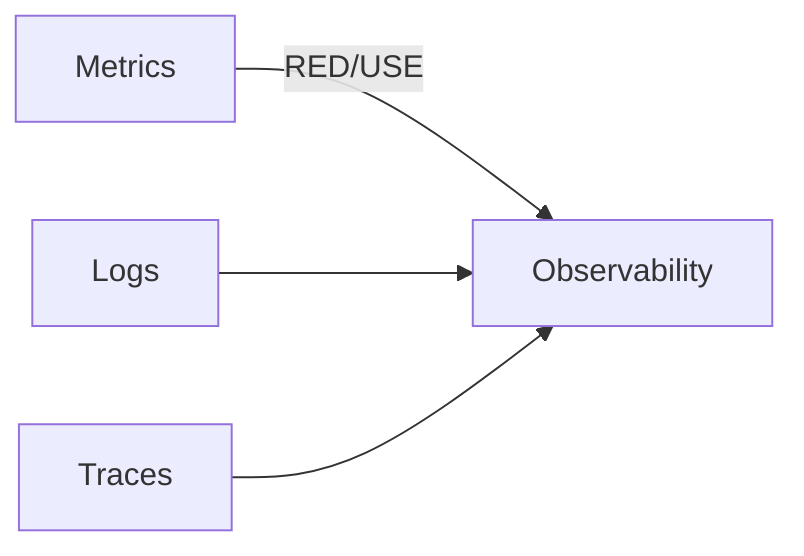
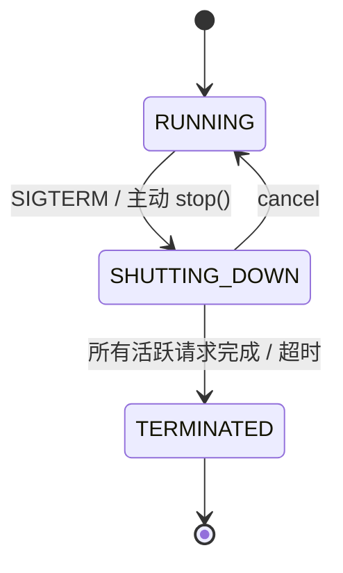
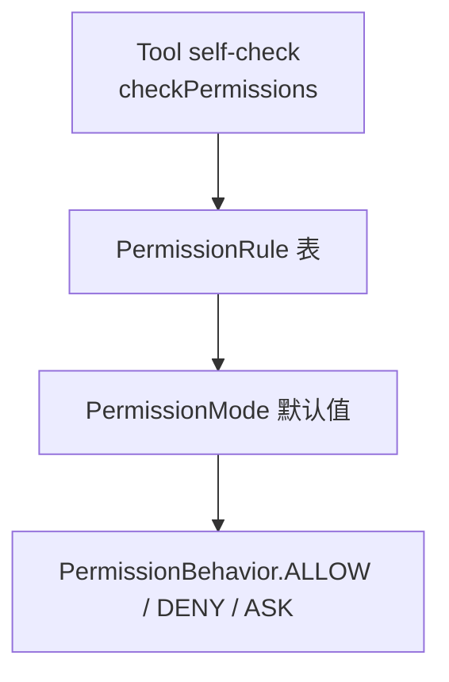

# Ch12 · 生产化：可观测性 / 优雅停机 / 权限系统（进阶）

> 状态：🔲 · 预计时长：2.5h · 前置：Ch11

## 1. 本章目标

- 掌握 `OtelTracingMiddleware` 集成 OpenTelemetry
- 掌握 `JsonlTraceExporter` 离线 trace 导出
- 理解 `GracefulShutdownManager` 的工作原理
- 理解 `PermissionEngine` 的多级权限决策
- 能用 trace 工具分析一次完整 ReAct 调用

## 2. 核心概念

### 2.1 可观测性三支柱



| 支柱 | 在框架中的位置 |
|---|---|
| **Traces** | `tracing/OtelTracingMiddleware` |
| **Metrics** | 通过 OTel / Spring Boot Actuator |
| **Logs** | SLF4J + Logback（无框架特殊处理） |

### 2.2 OpenTelemetry Middleware

`tracing/OtelTracingMiddleware.java`：

- 每次 agent 调创建一个 Root Span
- 嵌套 Span：reasoning / acting / tool_call / model_call
- 自动传播 trace context 到子 Agent / 工具

**Span 结构**：

```
agent.call
├── reasoning.iter0
│   ├── model.call
│   └── tool.read_file
│       └── mcp.request
├── reasoning.iter1
│   └── model.call
└── tool.write_file
```

### 2.3 `JsonlTraceExporter` 离线导出

`hook/recorder/JsonlTraceExporter.java`：

- 把所有 `AgentEvent` 写入 JSON Lines 文件
- 适合无 OTel collector 的环境
- 配合 `Hook` 实现

**格式**：

```json
{"timestamp": 1719600000000, "type": "AgentStartEvent", "replyId": "abc", "agent": "demo"}
{"timestamp": 1719600000010, "type": "PreReasoningEvent", "iter": 0}
...
```

### 2.4 优雅停机

`shutdown/GracefulShutdownManager.java`：



**关键点**：

- 正在执行的请求**不被 kill**，等它跑完
- 新请求**被拒绝**（直接返回错误）
- 超时后强制终止

**机制**：

1. `GracefulShutdownMiddleware` 检查 `ShutdownState`
2. 新请求 → 抛 `AgentShuttingDownException`
3. 现有请求 → 继续 + 写状态 `shutdownInterrupted=true`
4. `state` 持久化时记录此标志，下次启动可恢复

### 2.5 权限系统

`permission/PermissionEngine.java` + `permission/PermissionContextState.java`：

**决策级别**（从高到低）：



| 模式 | 行为 |
|---|---|
| `STRICT` | 全部 ASK（除白名单） |
| `NORMAL` | 读类工具 ALLOW，写类工具 ASK |
| `PERMISSIVE` | 全部 ALLOW（除黑名单） |

## 3. 源码精读

### 3.1 `OtelTracingMiddleware`

`tracing/OtelTracingMiddleware.java`（约 200 行）：

```java
public class OtelTracingMiddleware implements MiddlewareBase {
    private final Tracer tracer;

    @Override
    public Flux<AgentEvent> onAgent(...) {
        Span span = tracer.spanBuilder("agent.call")
            .setAttribute("agent.name", agent.getName())
            .startSpan();
        return next.apply(input)
            .doOnNext(e -> span.addEvent(e.getClass().getSimpleName()))
            .doFinally(sig -> span.end());
    }
}
```

**Span 命名约定**：

- `agent.{name}` 顶层
- `reasoning.iter{N}` 推理
- `tool.{name}` 工具
- `model.call` 模型调用

### 3.2 `JsonlTraceExporter`

`hook/recorder/JsonlTraceExporter.java:316`：

```java
public class JsonlTraceExporter implements Hook {
    private final BufferedWriter writer;

    @Override
    public Mono<HookEvent> onEvent(AgentEvent event, HookEventType type) {
        return Mono.fromRunnable(() -> {
            String json = JsonCodec.encode(event);
            writer.write(json);
            writer.newLine();
            writer.flush();
        }).thenReturn(new HookEvent(event, type));
    }
}
```

**注意**：v2 推荐用 `MiddlewareBase` 替代 `Hook` 写 trace。看 `recorder/` 是否有更新版本。

### 3.3 `GracefulShutdownManager`

`shutdown/GracefulShutdownManager.java:301`：

```java
while (getState() != ShutdownState.TERMINATED) {
    if (activeRequests.isEmpty()) {
        transitionTo(TERMINATED);
        break;
    }
    Thread.sleep(100);  // 等待活跃请求
}
```

**设计要点**：

- 用 `ActiveRequestContext` 跟踪活跃请求
- 状态转换用原子操作
- 注册 `JVM shutdown hook` 自动触发

### 3.4 `PermissionEngine` 决策流程

`permission/PermissionEngine.java`：

```java
public Mono<PermissionDecision> evaluate(
        ToolBase tool, Map<String,Object> input, PermissionContextState ctx) {
    return tool.checkPermissions(input, ctx)        // 1. 工具自检
        .switchIfEmpty(ruleEngine.match(tool, input)) // 2. 规则表
        .switchIfEmpty(modeBasedDefault(tool, ctx));  // 3. 模式兜底
}
```

**`PermissionBehavior`**：

- `ALLOW` → 立即执行
- `DENY` → 拒绝
- `ASK` → 抛 `ToolSuspendException`，Agent 暂停等用户

## 4. 设计权衡

| 选择 | 原因 |
|---|---|
| OTel 而非自研 trace | 生态标准，与 Jaeger / Zipkin / Tempo 兼容 |
| Jsonl 离线 trace 兜底 | 简单环境也能用 |
| 优雅停机而非硬 kill | 不破坏长期任务状态 |
| 权限三级决策 | 灵活度（自检 + 规则 + 模式） |
| PermissionContextState 进 state | 跨会话恢复权限状态 |

## 5. 实验任务

详见 [`lab/ch12-tracing-and-shutdown.md`](../lab/ch12-tracing-and-shutdown.md)。核心：

1. 注册 `JsonlTraceExporter`（或 OtelTracingMiddleware）跑一次
2. 触发 `GracefulShutdownManager.shutdown()`，观察活跃请求被等待
3. 跑一个 `STRICT` 模式的权限实验

## 6. 思考题

1. OTel Span 的 `parent` 是怎么传递的？（提示：`Reactor Context`）
2. `JsonlTraceExporter` 的写入性能瓶颈在哪？
3. 优雅停机等待活跃请求时，**新**请求会被怎么处理？

## 7. 参考资料

- `docs/v2/en/docs/others/going-to-production.md`（约 480 行，**必读**）
- OpenTelemetry Java SDK：<https://opentelemetry.io/docs/languages/java/>
- Jaeger：<https://www.jaegertracing.io/
- 优雅停机模式：<https://learnk8s.io/graceful-shutdown>

## 8. 学习笔记

在 `notes/ch12-my-takeaways.md` 写 3-5 条金句。

---

## 课程结语

12 章完成。你已掌握 `agentscope-java` 从核心到生产化的完整链路。

**下一步建议**：

- 用 `HarnessAgent` + `SubAgent` + `LongTermMemory` + MCP filesystem 工具实现结业项目
- 阅读 `agentscope-examples/agents/agentscope-codingagent` 完整示例
- 关注 `docs/v2/en/docs/change-log.md` 追踪版本变化
- 写 3 篇博客输出（最佳学习路径）

> 上一章：[Ch11](./ch11-mcp-a2a-protocols.md) · 回到 [00-index.md](../00-index.md)
